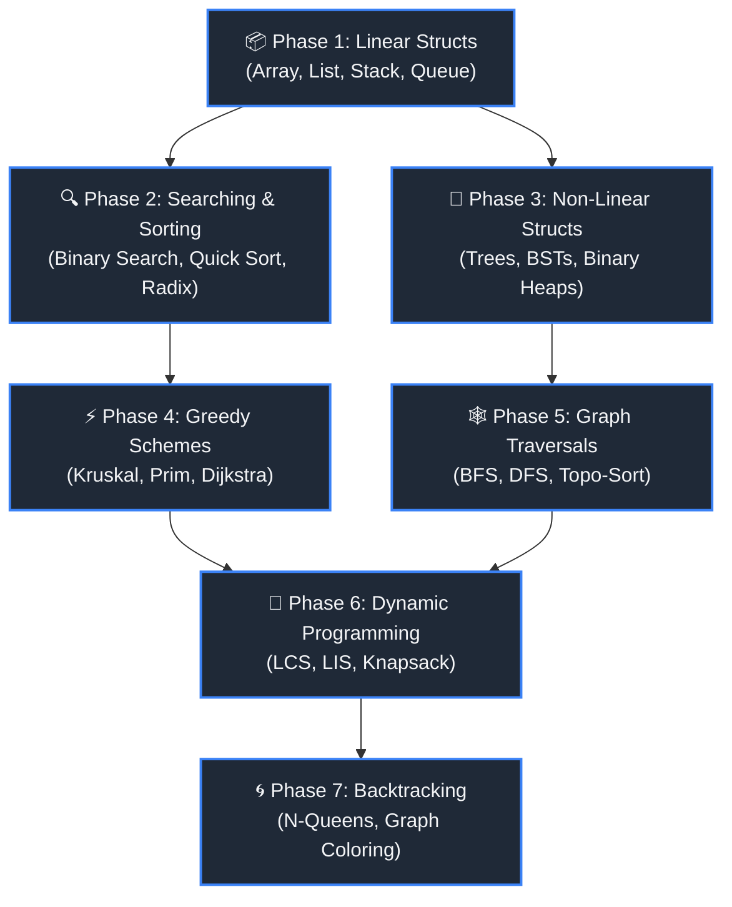

# 🎓 DSA Masterclass: C & C++ Learning Journey

A comprehensive, self-contained interactive dashboard documenting my progress, theory, and implementations of fundamental to advanced Data Structures and Algorithms in C and C++. 

> [!NOTE]
> This repository is fully self-contained. All theory, complexity metrics, notes, and C/C++ source code templates are located directly within this README under each topic. Suggested directory layouts and compilation tools are provided for offline development.


---

## 📝 Introduction

Welcome to the **Data Structures & Algorithms (DSA) Learning Journey** repository. This project is a highly structured, premium-grade dashboard documenting my progress as I implement fundamental and advanced DSA concepts from scratch using **C** and **C++**. 

This repository is designed to showcase clean code architecture, efficient memory management (raw pointers, memory leak prevention, reference tracking), and analytical rigour regarding time and space complexities. Whether you are a recruiter evaluating systems programming skills, a student learning the ropes, or a fellow developer, this repository acts as an interactive learning guide.

---

## 🗺️ Table of Contents
1. [Repository Structure](#📂-repository-structure)
2. [How to Use This Repository](#🛠️-how-to-use-this-repository)
3. [Global Progress Tracker](#📊-global-progress-tracker)
4. [Detailed Topic Dashboard](#🔍-detailed-topic-dashboard)
   - [Data Structures](#1-data-structures)
   - [Searching](#2-searching)
   - [Sorting](#3-sorting)
   - [Graph Algorithms](#4-graph-algorithms)
   - [Dynamic Programming](#5-dynamic-programming)
   - [Greedy Algorithms](#6-greedy-algorithms)
   - [Backtracking](#7-backtracking)
5. [Learning Roadmap](#🛣️-learning-roadmap)
6. [Future Topics](#🚀-future-topics)
7. [Setup & Compilation Guide](#⚙️-setup--compilation-guide)
8. [Conclusion](#📄-conclusion)

---

## 📂 Repository Structure

Below is the recommended clean folder structure. Every category is separated into its own folder, and every topic contains its source files and a localized theory document.

```text
dsa-learning-journey/
├── .github/
│   └── workflows/
│       └── cmake-ci.yml           # CI/CD compilation pipeline
├── CMakeLists.txt                 # Multiplatform build automation
├── LICENSE                        # MIT License
├── README.md                      # Main interactive dashboard
├── templates/
│   └── topic_template.md          # Guide for documenting new topics
└── src/
    ├── 01_data_structures/
    │   ├── array/                  └── array.[c/cpp]
    │   ├── linked_list/            └── singly_linked_list.[c/cpp]
    │   ├── doubly_linked_list/     └── doubly_linked_list.[c/cpp]
    │   ├── stack/                  └── stack.[c/cpp]
    │   ├── queue/                  └── queue.[c/cpp]
    │   ├── circular_queue/         └── circular_queue.[c/cpp]
    │   ├── trees/                  └── binary_tree.[c/cpp]
    │   ├── bst/                    └── binary_search_tree.[c/cpp]
    │   └── heap/                   └── heap.[c/cpp]
    ├── 02_searching/
    │   ├── linear_search/          └── linear_search.[c/cpp]
    │   ├── binary_search/          └── binary_search.[c/cpp]
    │   └── ternary_search/         └── ternary_search.[c/cpp]
    ├── 03_sorting/
    │   ├── bubble_sort/            └── bubble_sort.[c/cpp]
    │   ├── selection_sort/         └── selection_sort.[c/cpp]
    │   ├── insertion_sort/         └── insertion_sort.[c/cpp]
    │   ├── merge_sort/             └── merge_sort.[c/cpp]
    │   ├── quick_sort/             └── quick_sort.[c/cpp]
    │   ├── counting_sort/          └── counting_sort.[c/cpp]
    │   ├── heap_sort/              └── heap_sort.[c/cpp]
    │   └── radix_sort/             └── radix_sort.[c/cpp]
    ├── 04_graphs/
    │   ├── bfs/                    └── bfs.[c/cpp]
    │   ├── dfs/                    └── dfs.[c/cpp]
    │   ├── topological_sort/       └── topo_sort.[c/cpp]
    │   ├── dijkstra/               └── dijkstra.[c/cpp]
    │   ├── floyd_warshall/         └── floyd_warshall.[c/cpp]
    │   ├── bellman_ford/           └── bellman_ford.[c/cpp]
    │   ├── prim/                   └── prim.[c/cpp]
    │   └── kruskal/                └── kruskal.[c/cpp]
    ├── 05_dynamic_programming/
    │   ├── fibonacci/              └── fibonacci.[c/cpp]
    │   ├── coin_change/            └── coin_change_dp.[c/cpp]
    │   ├── longest_common_subsequence/ └── lcs.[c/cpp]
    │   ├── longest_increasing_subsequence/ └── lis.[c/cpp]
    │   └── zero_one_knapsack/      └── knapsack_01.[c/cpp]
    ├── 06_greedy_algorithms/
    │   ├── greedy_method/          └── activity_selection.[c/cpp]
    │   ├── dijkstra/               └── dijkstra_greedy.[c/cpp]
    │   ├── prim/                   └── prim_greedy.[c/cpp]
    │   ├── kruskal/                └── kruskal_greedy.[c/cpp]
    │   ├── fractional_knapsack/    └── fractional_knapsack.[c/cpp]
    │   ├── coin_change/            └── coin_change_greedy.[c/cpp]
    │   └── vertex_cover_approx/    └── vertex_cover.[c/cpp]
    └── 07_backtracking/
        ├── n_queens/               └── n_queens.[c/cpp]
        ├── sum_of_subsets/         └── sum_of_subsets.[c/cpp]
        ├── hamiltonian_cycle/      └── hamiltonian_cycle.[c/cpp]
        └── graph_coloring/         └── graph_coloring.[c/cpp]
```

---

## 🛠️ How to Use This Repository

1. **Explore the Dashboard:** Browse the categories in the Table of Contents or scroll to a category.
2. **Expand Topics:** Click on any topic (e.g., **Array**, **Dijkstra's Algorithm**) to expand its `<details>` block.
3. **Study & Implement:**
   - Review the **Short Explanation** and **Theory & Core Concepts**.
   - Check the **Asymptotic Complexity** tables.
   - Use the **C Template** or **C++ Template** placeholders directly inside the expanded block. You can paste your own written code solutions directly in these sections to keep everything consolidated.
4. **Practice:** Solve the recommended practice problems listed (without external links to maintain a self-contained learning environment).
5. **Track Progress:** Update the category-specific progress tracker tables as you complete each topic.

---

## 📊 Global Progress Tracker

| Category | Topics | Completed | Progress Rate | Status |
| :--- | :---: | :---: | :---: | :---: |
| [Data Structures](#1-data-structures) | 9 | 0 / 9 | 0% | ⏳ Planned |
| [Searching](#2-searching) | 3 | 0 / 3 | 0% | ⏳ Planned |
| [Sorting](#3-sorting) | 8 | 0 / 8 | 0% | ⏳ Planned |
| [Graph Algorithms](#4-graph-algorithms) | 8 | 0 / 8 | 0% | ⏳ Planned |
| [Dynamic Programming](#5-dynamic-programming) | 5 | 0 / 5 | 0% | ⏳ Planned |
| [Greedy Algorithms](#6-greedy-algorithms) | 7 | 0 / 7 | 0% | ⏳ Planned |
| [Backtracking](#7-backtracking) | 4 | 0 / 4 | 0% | ⏳ Planned |

---

## 🔍 Detailed Topic Dashboard

---

### 1. Data Structures

Data structures are specialized formats for organizing, processing, retrieving, and storing data. They form the core building block of any software program.


#### 📊 Category Progress Tracker

| Topic | Recommended File Name | C Status | C++ Status | Target Complexity |
| :--- | :--- | :---: | :---: | :---: |
| Array | `array.[c/cpp]` | ⏳ Planned | ⏳ Planned | Variable |
| Linked List | `singly_linked_list.[c/cpp]` | ⏳ Planned | ⏳ Planned | Variable |
| Doubly Linked List | `doubly_linked_list.[c/cpp]` | ⏳ Planned | ⏳ Planned | Variable |
| Stack | `stack.[c/cpp]` | ⏳ Planned | ⏳ Planned | Variable |
| Queue | `queue.[c/cpp]` | ⏳ Planned | ⏳ Planned | Variable |
| Circular Queue | `circular_queue.[c/cpp]` | ⏳ Planned | ⏳ Planned | Variable |
| Trees | `trees.[c/cpp]` | ⏳ Planned | ⏳ Planned | Variable |
| Binary Search Tree (BST) | `binary_search_tree.[c/cpp]` | ⏳ Planned | ⏳ Planned | Variable |
| Heap (Min Heap, Max Heap) | `heap.[c/cpp]` | ⏳ Planned | ⏳ Planned | Variable |


<details>
<summary><b>🔹 Array</b> (Expand for details)</summary>

#### 💡 Short Explanation
An Array is a collection of elements stored at contiguous memory locations. It allows you to access any element by its index directly in constant time.

#### 📘 Theory & Core Concepts
- **Direct Addressing:** Array elements are calculated using a base address and offset size.
- **Fixed Size:** Traditional arrays cannot scale dynamically. Custom implementations use dynamic sizing (doubles size upon reaching capacity).
- **Use Cases:** Buffer caching, lookup tables, implementation of heaps and stacks.

#### ⏱️ Asymptotic Complexity
| Operation | Average Case | Worst Case | Space Complexity |
| :--- | :---: | :---: | :---: |
| Access | $\mathcal{O}(1)$ | $\mathcal{O}(1)$ | $\mathcal{O}(N)$ Total |
| Search | $\mathcal{O}(N)$ | $\mathcal{O}(N)$ | - |
| Insertion | $\mathcal{O}(N)$ | $\mathcal{O}(N)$ | - |
| Deletion | $\mathcal{O}(N)$ | $\mathcal{O}(N)$ | - |

#### 💻 Source Code Placeholders

<details>
<summary>💻 View C Template Placeholder</summary>

```c
/**
 * @file array.c
 * @brief C Implementation of Array
 */

#include <stdio.h>
#include <stdlib.h>

// TODO: Paste your C implementation of Array here

int main() {
    printf("Running C implementation of Array...\n");
    // TODO: Write test cases and execute your operations here
    return 0;
}
```

</details>

<details>
<summary>💻 View C++ Template Placeholder</summary>

```cpp
/**
 * @file array.cpp
 * @brief C++ Implementation of Array
 */

#include <iostream>
#include <vector>
#include <string>
#include <algorithm>

// TODO: Paste your C++ implementation of Array here

int main() {
    std::cout << "Running C++ implementation of Array..." << std::endl;
    // TODO: Write test cases and execute your operations here
    return 0;
}
```

</details>
#### 📝 Notes & Observations
*   Inserting elements at the beginning requires shifting all items, making it $\mathcal{O}(N)$.
*   Dynamic arrays allocate memory on the heap. Be sure to call `free()` or use smart pointers to prevent memory leaks.

#### 🎯 Practice Problems
- [ ] LeetCode 26: Remove Duplicates (Easy)
- [ ] LeetCode 1: Two Sum (Easy)

#### 💡 Learning Tip
> **Pro-Tip:** Always verify bounds check checks to avoid buffer overflow errors.
</details>

<details>
<summary><b>🔹 Linked List</b> (Expand for details)</summary>

#### 💡 Short Explanation
A Singly Linked List is a linear collection of nodes where each node contains data and a pointer pointing to the next node in sequence.

#### 📘 Theory & Core Concepts
- **Dynamic Size:** Allocated dynamically in memory; doesn't require contiguous storage.
- **Sequential Access:** Elements must be traversed sequentially starting from the head.
- **Use Cases:** Undo/redo stacks, hash table chaining, memory allocation tables.

#### ⏱️ Asymptotic Complexity
| Operation | Average Case | Worst Case | Space Complexity |
| :--- | :---: | :---: | :---: |
| Access / Search | $\mathcal{O}(N)$ | $\mathcal{O}(N)$ | $\mathcal{O}(N)$ Total |
| Insertion (Head) | $\mathcal{O}(1)$ | $\mathcal{O}(1)$ | - |
| Insertion (Tail) | $\mathcal{O}(N)$ | $\mathcal{O}(N)$ | - |
| Deletion (Head) | $\mathcal{O}(1)$ | $\mathcal{O}(1)$ | - |

#### 💻 Source Code Placeholders

<details>
<summary>💻 View C Template Placeholder</summary>

```c
/**
 * @file linked_list.c
 * @brief C Implementation of Linked List
 */

#include <stdio.h>
#include <stdlib.h>

// TODO: Paste your C implementation of Linked List here

int main() {
    printf("Running C implementation of Linked List...\n");
    // TODO: Write test cases and execute your operations here
    return 0;
}
```

</details>

<details>
<summary>💻 View C++ Template Placeholder</summary>

```cpp
/**
 * @file linked_list.cpp
 * @brief C++ Implementation of Linked List
 */

#include <iostream>
#include <vector>
#include <string>
#include <algorithm>

// TODO: Paste your C++ implementation of Linked List here

int main() {
    std::cout << "Running C++ implementation of Linked List..." << std::endl;
    // TODO: Write test cases and execute your operations here
    return 0;
}
```

</details>
#### 📝 Notes & Observations
*   Linked lists have a high memory overhead because they store a pointer along with each data member.
*   Always update the `next` pointer of surrounding nodes *before* freeing the target node.

#### 🎯 Practice Problems
- [ ] LeetCode 206: Reverse Linked List (Easy)
- [ ] LeetCode 141: Linked List Cycle Detection (Easy)

#### 💡 Learning Tip
> **Pro-Tip:** Draw pointer arrows on paper to visualize linking operations before coding.
</details>

<details>
<summary><b>🔹 Doubly Linked List</b> (Expand for details)</summary>

#### 💡 Short Explanation
A Doubly Linked List (DLL) is a node-based data structure where each node contains data, a pointer to the next node, and a pointer to the previous node.

#### 📘 Theory & Core Concepts
- **Bi-directional Traversal:** Allows traversal in both forward and backward directions.
- **Simplified Deletions:** Deleting a node is faster because we have direct access to its predecessor.
- **Use Cases:** LRU Cache implementation, navigation systems (browser history).

#### ⏱️ Asymptotic Complexity
| Operation | Average Case | Worst Case | Space Complexity |
| :--- | :---: | :---: | :---: |
| Access / Search | $\mathcal{O}(N)$ | $\mathcal{O}(N)$ | $\mathcal{O}(N)$ Total |
| Insertion / Deletion | $\mathcal{O}(1)$ | $\mathcal{O}(1)$ | - |

#### 💻 Source Code Placeholders

<details>
<summary>💻 View C Template Placeholder</summary>

```c
/**
 * @file doubly_linked_list.c
 * @brief C Implementation of Doubly Linked List
 */

#include <stdio.h>
#include <stdlib.h>

// TODO: Paste your C implementation of Doubly Linked List here

int main() {
    printf("Running C implementation of Doubly Linked List...\n");
    // TODO: Write test cases and execute your operations here
    return 0;
}
```

</details>

<details>
<summary>💻 View C++ Template Placeholder</summary>

```cpp
/**
 * @file doubly_linked_list.cpp
 * @brief C++ Implementation of Doubly Linked List
 */

#include <iostream>
#include <vector>
#include <string>
#include <algorithm>

// TODO: Paste your C++ implementation of Doubly Linked List here

int main() {
    std::cout << "Running C++ implementation of Doubly Linked List..." << std::endl;
    // TODO: Write test cases and execute your operations here
    return 0;
}
```

</details>
#### 📝 Notes & Observations
*   Maintains more pointers, increasing potential for error during implementation (dangling pointer bugs).
*   Always initialize head and tail pointers to `NULL` for an empty DLL.

#### 🎯 Practice Problems
- [ ] LeetCode 430: Flatten Multilevel DLL (Medium)
- [ ] LeetCode 146: LRU Cache (Hard)

#### 💡 Learning Tip
> **Pro-Tip:** Remember to update four pointers for any internal node insertion or deletion.
</details>

<details>
<summary><b>🔹 Stack</b> (Expand for details)</summary>

#### 💡 Short Explanation
A Stack is a linear data structure that follows the **Last-In, First-Out (LIFO)** protocol. The last element added is the first one removed.

#### 📘 Theory & Core Concepts
- **Push & Pop:** Elements are inserted and removed from the same end, called the `top`.
- **Implementations:** Can be built using contiguous arrays (static) or linked nodes (dynamic).
- **Use Cases:** Recursion management, compiler parsing (parenthesis validation), call stack execution.

#### ⏱️ Asymptotic Complexity
| Operation | Average Case | Worst Case | Space Complexity |
| :--- | :---: | :---: | :---: |
| Push | $\mathcal{O}(1)$ | $\mathcal{O}(1)$ | $\mathcal{O}(N)$ Total |
| Pop | $\mathcal{O}(1)$ | $\mathcal{O}(1)$ | - |
| Top/Peek | $\mathcal{O}(1)$ | $\mathcal{O}(1)$ | - |

#### 💻 Source Code Placeholders

<details>
<summary>💻 View C Template Placeholder</summary>

```c
/**
 * @file stack.c
 * @brief C Implementation of Stack
 */

#include <stdio.h>
#include <stdlib.h>

// TODO: Paste your C implementation of Stack here

int main() {
    printf("Running C implementation of Stack...\n");
    // TODO: Write test cases and execute your operations here
    return 0;
}
```

</details>

<details>
<summary>💻 View C++ Template Placeholder</summary>

```cpp
/**
 * @file stack.cpp
 * @brief C++ Implementation of Stack
 */

#include <iostream>
#include <vector>
#include <string>
#include <algorithm>

// TODO: Paste your C++ implementation of Stack here

int main() {
    std::cout << "Running C++ implementation of Stack..." << std::endl;
    // TODO: Write test cases and execute your operations here
    return 0;
}
```

</details>
#### 📝 Notes & Observations
*   Stack overflow occurs when a static stack exceeds maximum capacity.
*   Stack underflow occurs when trying to pop from an empty stack.

#### 🎯 Practice Problems
- [ ] LeetCode 20: Valid Parentheses (Easy)
- [ ] LeetCode 155: Min Stack (Medium)

#### 💡 Learning Tip
> **Pro-Tip:** A stack is ideal when you need to backtrack or reverse elements.
</details>

<details>
<summary><b>🔹 Queue</b> (Expand for details)</summary>

#### 💡 Short Explanation
A Queue is a linear data structure that follows the **First-In, First-Out (FIFO)** protocol. Elements are inserted at the rear and removed from the front.

#### 📘 Theory & Core Concepts
- **Enqueue & Dequeue:** Enqueue adds items to the tail; dequeue removes items from the head.
- **Memory Shifting:** In array implementations, dequeuing from index 0 creates empty space at the front, leading to circular layouts.
- **Use Cases:** Breadth-First Search (BFS), task scheduling (CPU queue), print spoolers.

#### ⏱️ Asymptotic Complexity
| Operation | Average Case | Worst Case | Space Complexity |
| :--- | :---: | :---: | :---: |
| Enqueue | $\mathcal{O}(1)$ | $\mathcal{O}(1)$ | $\mathcal{O}(N)$ Total |
| Dequeue | $\mathcal{O}(1)$ | $\mathcal{O}(1)$ | - |
| Front/Peek | $\mathcal{O}(1)$ | $\mathcal{O}(1)$ | - |

#### 💻 Source Code Placeholders

<details>
<summary>💻 View C Template Placeholder</summary>

```c
/**
 * @file queue.c
 * @brief C Implementation of Queue
 */

#include <stdio.h>
#include <stdlib.h>

// TODO: Paste your C implementation of Queue here

int main() {
    printf("Running C implementation of Queue...\n");
    // TODO: Write test cases and execute your operations here
    return 0;
}
```

</details>

<details>
<summary>💻 View C++ Template Placeholder</summary>

```cpp
/**
 * @file queue.cpp
 * @brief C++ Implementation of Queue
 */

#include <iostream>
#include <vector>
#include <string>
#include <algorithm>

// TODO: Paste your C++ implementation of Queue here

int main() {
    std::cout << "Running C++ implementation of Queue..." << std::endl;
    // TODO: Write test cases and execute your operations here
    return 0;
}
```

</details>
#### 📝 Notes & Observations
*   If using an array without optimization, dequeuing requires shifting elements, degrading performance to $\mathcal{O}(N)$.
*   Solve this by maintaining a sliding `head` index or implementing a Circular Queue.

#### 🎯 Practice Problems
- [ ] LeetCode 225: Implement Stack using Queues (Easy)
- [ ] LeetCode 933: Number of Recent Calls (Easy)

#### 💡 Learning Tip
> **Pro-Tip:** Think of queues as a physical line at a ticket counter. First come, first served.
</details>

<details>
<summary><b>🔹 Circular Queue</b> (Expand for details)</summary>

#### 💡 Short Explanation
A Circular Queue is an optimization of the standard queue where the last position is connected back to the first position to form a circle.

#### 📘 Theory & Core Concepts
- **Ring Buffer:** Eliminates wasted memory slots left behind by sequential dequeue operations.
- **Modulo Arithmetic:** Indices wrap around using the formula `(rear + 1) % capacity`.
- **Use Cases:** Traffic control systems, memory buffers in hardware, audio loop processing.

#### ⏱️ Asymptotic Complexity
| Operation | Average Case | Worst Case | Space Complexity |
| :--- | :---: | :---: | :---: |
| Enqueue | $\mathcal{O}(1)$ | $\mathcal{O}(1)$ | $\mathcal{O}(N)$ Total |
| Dequeue | $\mathcal{O}(1)$ | $\mathcal{O}(1)$ | - |

#### 💻 Source Code Placeholders

<details>
<summary>💻 View C Template Placeholder</summary>

```c
/**
 * @file circular_queue.c
 * @brief C Implementation of Circular Queue
 */

#include <stdio.h>
#include <stdlib.h>

// TODO: Paste your C implementation of Circular Queue here

int main() {
    printf("Running C implementation of Circular Queue...\n");
    // TODO: Write test cases and execute your operations here
    return 0;
}
```

</details>

<details>
<summary>💻 View C++ Template Placeholder</summary>

```cpp
/**
 * @file circular_queue.cpp
 * @brief C++ Implementation of Circular Queue
 */

#include <iostream>
#include <vector>
#include <string>
#include <algorithm>

// TODO: Paste your C++ implementation of Circular Queue here

int main() {
    std::cout << "Running C++ implementation of Circular Queue..." << std::endl;
    // TODO: Write test cases and execute your operations here
    return 0;
}
```

</details>
#### 📝 Notes & Observations
*   A circular queue is full when `(rear + 1) % capacity == front`.
*   It is empty when `front == -1` or `front == rear` (depending on flag checks).

#### 🎯 Practice Problems
- [ ] LeetCode 622: Design Circular Queue (Medium)
- [ ] LeetCode 641: Design Circular Deque (Medium)

#### 💡 Learning Tip
> **Pro-Tip:** Standardize wrapping index math using `%` division logic.
</details>

<details>
<summary><b>🔹 Trees</b> (Expand for details)</summary>

#### 💡 Short Explanation
A Binary Tree is a hierarchical structure where each node has at most two children, referred to as the left child and the right child.

#### 📘 Theory & Core Concepts
- **Hierarchical Node Layout:** Starts from a single parent node called the `Root`. Nodes with no children are `Leaf` nodes.
- **Traversals:** Pre-order (Root-L-R), In-order (L-Root-R), and Post-order (L-R-Root).
- **Use Cases:** DOM in browsers, file storage systems, syntax tree compilers.

#### ⏱️ Asymptotic Complexity
| Operation | Average Case | Worst Case | Space Complexity |
| :--- | :---: | :---: | :---: |
| Traversal | $\mathcal{O}(N)$ | $\mathcal{O}(N)$ | $\mathcal{O}(H)$ Auxiliary |
| Height Check | $\mathcal{O}(N)$ | $\mathcal{O}(N)$ | - |

#### 💻 Source Code Placeholders

<details>
<summary>💻 View C Template Placeholder</summary>

```c
/**
 * @file trees.c
 * @brief C Implementation of Trees
 */

#include <stdio.h>
#include <stdlib.h>

// TODO: Paste your C implementation of Trees here

int main() {
    printf("Running C implementation of Trees...\n");
    // TODO: Write test cases and execute your operations here
    return 0;
}
```

</details>

<details>
<summary>💻 View C++ Template Placeholder</summary>

```cpp
/**
 * @file trees.cpp
 * @brief C++ Implementation of Trees
 */

#include <iostream>
#include <vector>
#include <string>
#include <algorithm>

// TODO: Paste your C++ implementation of Trees here

int main() {
    std::cout << "Running C++ implementation of Trees..." << std::endl;
    // TODO: Write test cases and execute your operations here
    return 0;
}
```

</details>
#### 📝 Notes & Observations
*   Recursion is the cleanest way to traverse a tree, which consumes $\mathcal{O}(H)$ space on the call stack, where $H$ is the tree height.
*   If the tree is completely skewed (linear), $H$ becomes equal to $N$.

#### 🎯 Practice Problems
- [ ] LeetCode 104: Maximum Depth of Binary Tree (Easy)
- [ ] LeetCode 226: Invert Binary Tree (Easy)

#### 💡 Learning Tip
> **Pro-Tip:** In-order traversal of a BST always yields elements in ascending order.
</details>

<details>
<summary><b>🔹 BST (Binary Search Tree)</b> (Expand for details)</summary>

#### 💡 Short Explanation
A Binary Search Tree is a binary tree with ordering constraints: for any node, left descendants are smaller, and right descendants are larger.

#### 📘 Theory & Core Concepts
- **Searching Principle:** Splits the search space in half at each step (when balanced), similar to binary search.
- **Deletions:** Requires replacing deleted internal nodes with their In-order Successor or Predecessor.
- **Use Cases:** Map/Set database lookups, autocomplete index structures.

#### ⏱️ Asymptotic Complexity
| Operation | Average Case | Worst Case | Space Complexity |
| :--- | :---: | :---: | :---: |
| Search | $\mathcal{O}(\log N)$ | $\mathcal{O}(N)$ | $\mathcal{O}(N)$ Total |
| Insertion | $\mathcal{O}(\log N)$ | $\mathcal{O}(N)$ | - |
| Deletion | $\mathcal{O}(\log N)$ | $\mathcal{O}(N)$ | - |

#### 💻 Source Code Placeholders

<details>
<summary>💻 View C Template Placeholder</summary>

```c
/**
 * @file bst_binary_search_tree.c
 * @brief C Implementation of BST (Binary Search Tree)
 */

#include <stdio.h>
#include <stdlib.h>

// TODO: Paste your C implementation of BST (Binary Search Tree) here

int main() {
    printf("Running C implementation of BST (Binary Search Tree)...\n");
    // TODO: Write test cases and execute your operations here
    return 0;
}
```

</details>

<details>
<summary>💻 View C++ Template Placeholder</summary>

```cpp
/**
 * @file bst_binary_search_tree.cpp
 * @brief C++ Implementation of BST (Binary Search Tree)
 */

#include <iostream>
#include <vector>
#include <string>
#include <algorithm>

// TODO: Paste your C++ implementation of BST (Binary Search Tree) here

int main() {
    std::cout << "Running C++ implementation of BST (Binary Search Tree)..." << std::endl;
    // TODO: Write test cases and execute your operations here
    return 0;
}
```

</details>
#### 📝 Notes & Observations
*   Worst-case $\mathcal{O}(N)$ happens when elements are inserted in sorted order, creating a linear structure.
*   Self-balancing trees (AVL, Red-Black) prevent this degradation.

#### 🎯 Practice Problems
- [ ] LeetCode 98: Validate Binary Search Tree (Medium)
- [ ] LeetCode 701: Insert into a BST (Medium)

#### 💡 Learning Tip
> **Pro-Tip:** Draw node connections step-by-step when implementing node deletions.
</details>

<details>
<summary><b>🔹 Heap (Min Heap, Max Heap)</b> (Expand for details)</summary>

#### 💡 Short Explanation
A Heap is a complete binary tree that maintains the heap property: parent nodes are either smaller (Min Heap) or larger (Max Heap) than their children.

#### 📘 Theory & Core Concepts
- **Array Layout:** Usually stored in an array where for index $i$: left child is at $2i + 1$ and right child is at $2i + 2$.
- **Heapify:** Balancing operations (heapify-up, heapify-down) preserve structural properties on insertions/deletions.
- **Use Cases:** Priority queues, Dijkstra's algorithm, Heap Sort.

#### ⏱️ Asymptotic Complexity
| Operation | Average Case | Worst Case | Space Complexity |
| :--- | :---: | :---: | :---: |
| Get Min/Max | $\mathcal{O}(1)$ | $\mathcal{O}(1)$ | $\mathcal{O}(N)$ Total |
| Insert / Extract | $\mathcal{O}(\log N)$ | $\mathcal{O}(\log N)$ | - |
| Heapify Array | $\mathcal{O}(N)$ | $\mathcal{O}(N)$ | - |

#### 💻 Source Code Placeholders

<details>
<summary>💻 View C Template Placeholder</summary>

```c
/**
 * @file heap_min_heap,_max_heap.c
 * @brief C Implementation of Heap (Min Heap, Max Heap)
 */

#include <stdio.h>
#include <stdlib.h>

// TODO: Paste your C implementation of Heap (Min Heap, Max Heap) here

int main() {
    printf("Running C implementation of Heap (Min Heap, Max Heap)...\n");
    // TODO: Write test cases and execute your operations here
    return 0;
}
```

</details>

<details>
<summary>💻 View C++ Template Placeholder</summary>

```cpp
/**
 * @file heap_min_heap,_max_heap.cpp
 * @brief C++ Implementation of Heap (Min Heap, Max Heap)
 */

#include <iostream>
#include <vector>
#include <string>
#include <algorithm>

// TODO: Paste your C++ implementation of Heap (Min Heap, Max Heap) here

int main() {
    std::cout << "Running C++ implementation of Heap (Min Heap, Max Heap)..." << std::endl;
    // TODO: Write test cases and execute your operations here
    return 0;
}
```

</details>
#### 📝 Notes & Observations
*   Extracting the root element requires swapping it with the last element in the array and performing a heapify-down operation.
*   Searching for an arbitrary element in a heap takes $\mathcal{O}(N)$ time.

#### 🎯 Practice Problems
- [ ] LeetCode 215: Kth Largest Element (Medium)
- [ ] LeetCode 347: Top K Frequent Elements (Medium)

#### 💡 Learning Tip
> **Pro-Tip:** Heaps are perfect when you need quick access to the minimum or maximum element.
</details>

---

### 2. Searching

Searching algorithms traverse a data structure to retrieve a target element.


#### 📊 Category Progress Tracker

| Topic | Recommended File Name | C Status | C++ Status | Target Complexity |
| :--- | :--- | :---: | :---: | :---: |
| Linear Search | `linear_search.[c/cpp]` | ⏳ Planned | ⏳ Planned | Variable |
| Binary Search | `binary_search.[c/cpp]` | ⏳ Planned | ⏳ Planned | Variable |
| Ternary Search | `ternary_search.[c/cpp]` | ⏳ Planned | ⏳ Planned | Variable |


<details>
<summary><b>🔹 Linear Search</b> (Expand for details)</summary>

#### 💡 Short Explanation
Linear Search steps through a collection sequentially, checking each element until a match is found or the structure ends.

#### 📘 Theory & Core Concepts
- **Brute Force:** Checks every index from $0$ to $N-1$.
- **No Prerequisites:** Works on unsorted data structures.
- **Use Cases:** Short arrays, unsorted lists, stream analysis.

#### ⏱️ Asymptotic Complexity
| Scenario | Time Complexity | Space Complexity |
| :--- | :---: | :---: |
| Best Case | $\mathcal{O}(1)$ | $\mathcal{O}(1)$ |
| Average Case | $\mathcal{O}(N)$ | - |
| Worst Case | $\mathcal{O}(N)$ | - |

#### 💻 Source Code Placeholders

<details>
<summary>💻 View C Template Placeholder</summary>

```c
/**
 * @file linear_search.c
 * @brief C Implementation of Linear Search
 */

#include <stdio.h>
#include <stdlib.h>

// TODO: Paste your C implementation of Linear Search here

int main() {
    printf("Running C implementation of Linear Search...\n");
    // TODO: Write test cases and execute your operations here
    return 0;
}
```

</details>

<details>
<summary>💻 View C++ Template Placeholder</summary>

```cpp
/**
 * @file linear_search.cpp
 * @brief C++ Implementation of Linear Search
 */

#include <iostream>
#include <vector>
#include <string>
#include <algorithm>

// TODO: Paste your C++ implementation of Linear Search here

int main() {
    std::cout << "Running C++ implementation of Linear Search..." << std::endl;
    // TODO: Write test cases and execute your operations here
    return 0;
}
```

</details>
#### 📝 Notes & Observations
*   Inefficient for large datasets compared to binary search.
*   Can be optimized slightly by swapping found elements towards the front (Transposition).

#### 🎯 Practice Problems
- [ ] HackerRank: Linear Search Practice (Easy)

#### 💡 Learning Tip
> **Pro-Tip:** Use linear search only when the data is small or completely unsorted.
</details>

<details>
<summary><b>🔹 Binary Search</b> (Expand for details)</summary>

#### 💡 Short Explanation
Binary Search divides a sorted search space in half at each step, checking the middle element to determine which half to search next.

#### 📘 Theory & Core Concepts
- **Prerequisite:** Elements **must be sorted**.
- **Divide and Conquer:** Compares the target against the midpoint, discarding half the remaining elements.
- **Use Cases:** Index search engines, solving optimization problems (search over value range).

#### ⏱️ Asymptotic Complexity
| Scenario | Time Complexity | Space Complexity |
| :--- | :---: | :---: |
| Best Case | $\mathcal{O}(1)$ | $\mathcal{O}(1)$ |
| Average / Worst Case | $\mathcal{O}(\log N)$ | - |

#### 💻 Source Code Placeholders

<details>
<summary>💻 View C Template Placeholder</summary>

```c
/**
 * @file binary_search.c
 * @brief C Implementation of Binary Search
 */

#include <stdio.h>
#include <stdlib.h>

// TODO: Paste your C implementation of Binary Search here

int main() {
    printf("Running C implementation of Binary Search...\n");
    // TODO: Write test cases and execute your operations here
    return 0;
}
```

</details>

<details>
<summary>💻 View C++ Template Placeholder</summary>

```cpp
/**
 * @file binary_search.cpp
 * @brief C++ Implementation of Binary Search
 */

#include <iostream>
#include <vector>
#include <string>
#include <algorithm>

// TODO: Paste your C++ implementation of Binary Search here

int main() {
    std::cout << "Running C++ implementation of Binary Search..." << std::endl;
    // TODO: Write test cases and execute your operations here
    return 0;
}
```

</details>
#### 📝 Notes & Observations
*   Watch out for integer overflow when calculating the midpoint: use `low + (high - low) / 2` instead of `(low + high) / 2`.
*   Can be implemented recursively (which uses stack memory) or iteratively (which uses constant space).

#### 🎯 Practice Problems
- [ ] LeetCode 704: Binary Search (Easy)
- [ ] LeetCode 34: First/Last Position of Element (Medium)

#### 💡 Learning Tip
> **Pro-Tip:** Binary search can be applied to any monotonic function, not just sorted arrays.
</details>

<details>
<summary><b>🔹 Ternary Search</b> (Expand for details)</summary>

#### 💡 Short Explanation
Ternary Search divides a sorted search space into three equal parts using two midpoints, reducing the search space to two-thirds at each step.

#### 📘 Theory & Core Concepts
- **Dividing by Three:** Calculates `mid1 = low + (high - low) / 3` and `mid2 = high - (high - low) / 3`.
- **Optimization Traps:** Performs more comparisons than binary search, making it slower in practice for simple arrays.
- **Use Cases:** Finding local maxima/minima of unimodal functions.

#### ⏱️ Asymptotic Complexity
| Scenario | Time Complexity | Space Complexity |
| :--- | :---: | :---: |
| Best Case | $\mathcal{O}(1)$ | $\mathcal{O}(1)$ |
| Average / Worst Case | $\mathcal{O}(\log_3 N)$ | - |

#### 💻 Source Code Placeholders

<details>
<summary>💻 View C Template Placeholder</summary>

```c
/**
 * @file ternary_search.c
 * @brief C Implementation of Ternary Search
 */

#include <stdio.h>
#include <stdlib.h>

// TODO: Paste your C implementation of Ternary Search here

int main() {
    printf("Running C implementation of Ternary Search...\n");
    // TODO: Write test cases and execute your operations here
    return 0;
}
```

</details>

<details>
<summary>💻 View C++ Template Placeholder</summary>

```cpp
/**
 * @file ternary_search.cpp
 * @brief C++ Implementation of Ternary Search
 */

#include <iostream>
#include <vector>
#include <string>
#include <algorithm>

// TODO: Paste your C++ implementation of Ternary Search here

int main() {
    std::cout << "Running C++ implementation of Ternary Search..." << std::endl;
    // TODO: Write test cases and execute your operations here
    return 0;
}
```

</details>
#### 📝 Notes & Observations
*   While $\log_3(N)$ is mathematically smaller than $\log_2(N)$, ternary search performs more comparisons per step, resulting in a higher constant factor.
*   Ideal for finding the peak point of a parabolic curve.

#### 🎯 Practice Problems
- [ ] Codeforces: Ternary Search Tasks (Medium)

#### 💡 Learning Tip
> **Pro-Tip:** Use ternary search when you need to find the peak (maximum or minimum) of a curve.
</details>

---

### 3. Sorting

Sorting algorithms reorder elements in a collection according to a specific comparison operation.


#### 📊 Category Progress Tracker

| Topic | Recommended File Name | C Status | C++ Status | Target Complexity |
| :--- | :--- | :---: | :---: | :---: |
| Bubble Sort | `bubble_sort.[c/cpp]` | ⏳ Planned | ⏳ Planned | Variable |
| Selection Sort | `selection_sort.[c/cpp]` | ⏳ Planned | ⏳ Planned | Variable |
| Insertion Sort | `insertion_sort.[c/cpp]` | ⏳ Planned | ⏳ Planned | Variable |
| Merge Sort | `merge_sort.[c/cpp]` | ⏳ Planned | ⏳ Planned | Variable |
| Quick Sort | `quick_sort.[c/cpp]` | ⏳ Planned | ⏳ Planned | Variable |
| Counting Sort | `counting_sort.[c/cpp]` | ⏳ Planned | ⏳ Planned | Variable |
| Heap Sort | `heap_sort.[c/cpp]` | ⏳ Planned | ⏳ Planned | Variable |
| Radix Sort | `radix_sort.[c/cpp]` | ⏳ Planned | ⏳ Planned | Variable |


<details>
<summary><b>🔹 Bubble Sort</b> (Expand for details)</summary>

#### 💡 Short Explanation
Bubble Sort repeatedly compares adjacent elements and swaps them if they are in the wrong order. The largest element "bubbles" to its correct position at the end of each pass.

#### 📘 Theory & Core Concepts
- **Comparison-based:** Slowly propagates elements.
- **Stable Sort:** Preserves the relative order of duplicate elements.
- **Use Cases:** Teaching sorting concepts, small or nearly sorted datasets.

#### ⏱️ Asymptotic Complexity
| Scenario | Time Complexity | Space Complexity |
| :--- | :---: | :---: |
| Best Case (Optimized) | $\mathcal{O}(N)$ | $\mathcal{O}(1)$ Auxiliary |
| Average / Worst Case | $\mathcal{O}(N^2)$ | - |

#### 💻 Source Code Placeholders

<details>
<summary>💻 View C Template Placeholder</summary>

```c
/**
 * @file bubble_sort.c
 * @brief C Implementation of Bubble Sort
 */

#include <stdio.h>
#include <stdlib.h>

// TODO: Paste your C implementation of Bubble Sort here

int main() {
    printf("Running C implementation of Bubble Sort...\n");
    // TODO: Write test cases and execute your operations here
    return 0;
}
```

</details>

<details>
<summary>💻 View C++ Template Placeholder</summary>

```cpp
/**
 * @file bubble_sort.cpp
 * @brief C++ Implementation of Bubble Sort
 */

#include <iostream>
#include <vector>
#include <string>
#include <algorithm>

// TODO: Paste your C++ implementation of Bubble Sort here

int main() {
    std::cout << "Running C++ implementation of Bubble Sort..." << std::endl;
    // TODO: Write test cases and execute your operations here
    return 0;
}
```

</details>
#### 📝 Notes & Observations
*   An optimization flag `swapped` can stop execution early if no swaps occur during a pass, reducing the best-case complexity to $\mathcal{O}(N)$.
*   Not suitable for large datasets due to its quadratic time complexity.

#### 🎯 Practice Problems
- [ ] HackerRank: Bubble Sort (Easy)

#### 💡 Learning Tip
> **Pro-Tip:** Bubble sort is stable, in-place, and simple, but rarely used in production.
</details>

<details>
<summary><b>🔹 Selection Sort</b> (Expand for details)</summary>

#### 💡 Short Explanation
Selection Sort divides the array into sorted and unsorted regions. It repeatedly finds the minimum element from the unsorted region and swaps it with the first unsorted element.

#### 📘 Theory & Core Concepts
- **Fixed Swaps:** Performs at most $\mathcal{O}(N)$ swaps, which is useful when write operations are expensive.
- **Unstable Sort:** Swapping elements across large distances can disrupt their relative order.
- **Use Cases:** Systems with limited write budgets (e.g., EEPROM flash storage).

#### ⏱️ Asymptotic Complexity
| Scenario | Time Complexity | Space Complexity |
| :--- | :---: | :---: |
| Best / Avg / Worst Case | $\mathcal{O}(N^2)$ | $\mathcal{O}(1)$ Auxiliary |

#### 💻 Source Code Placeholders

<details>
<summary>💻 View C Template Placeholder</summary>

```c
/**
 * @file selection_sort.c
 * @brief C Implementation of Selection Sort
 */

#include <stdio.h>
#include <stdlib.h>

// TODO: Paste your C implementation of Selection Sort here

int main() {
    printf("Running C implementation of Selection Sort...\n");
    // TODO: Write test cases and execute your operations here
    return 0;
}
```

</details>

<details>
<summary>💻 View C++ Template Placeholder</summary>

```cpp
/**
 * @file selection_sort.cpp
 * @brief C++ Implementation of Selection Sort
 */

#include <iostream>
#include <vector>
#include <string>
#include <algorithm>

// TODO: Paste your C++ implementation of Selection Sort here

int main() {
    std::cout << "Running C++ implementation of Selection Sort..." << std::endl;
    // TODO: Write test cases and execute your operations here
    return 0;
}
```

</details>
#### 📝 Notes & Observations
*   Selection sort always runs in $\mathcal{O}(N^2)$ time because it scans the remaining unsorted subarray regardless of whether it is already sorted.
*   Performs minimal memory writes.

#### 🎯 Practice Problems
- [ ] LeetCode 912: Sort an Array (Medium)

#### 💡 Learning Tip
> **Pro-Tip:** Selection sort is simple and minimizes writes, but is generally slow.
</details>

<details>
<summary><b>🔹 Insertion Sort</b> (Expand for details)</summary>

#### 💡 Short Explanation
Insertion Sort builds the final sorted array one item at a time by sliding unsorted elements into their correct position within the sorted subarray.

#### 📘 Theory & Core Concepts
- **Incremental Sorting:** Iterates through the array, moving elements out of place backwards into their sorted position.
- **Online Sorting:** Can sort a list as it receives it.
- **Use Cases:** Small arrays, nearly sorted arrays, hybrid sorting algorithms (like Timsort).

#### ⏱️ Asymptotic Complexity
| Scenario | Time Complexity | Space Complexity |
| :--- | :---: | :---: |
| Best Case (Nearly Sorted)| $\mathcal{O}(N)$ | $\mathcal{O}(1)$ Auxiliary |
| Average / Worst Case | $\mathcal{O}(N^2)$ | - |

#### 💻 Source Code Placeholders

<details>
<summary>💻 View C Template Placeholder</summary>

```c
/**
 * @file insertion_sort.c
 * @brief C Implementation of Insertion Sort
 */

#include <stdio.h>
#include <stdlib.h>

// TODO: Paste your C implementation of Insertion Sort here

int main() {
    printf("Running C implementation of Insertion Sort...\n");
    // TODO: Write test cases and execute your operations here
    return 0;
}
```

</details>

<details>
<summary>💻 View C++ Template Placeholder</summary>

```cpp
/**
 * @file insertion_sort.cpp
 * @brief C++ Implementation of Insertion Sort
 */

#include <iostream>
#include <vector>
#include <string>
#include <algorithm>

// TODO: Paste your C++ implementation of Insertion Sort here

int main() {
    std::cout << "Running C++ implementation of Insertion Sort..." << std::endl;
    // TODO: Write test cases and execute your operations here
    return 0;
}
```

</details>
#### 📝 Notes & Observations
*   Highly efficient for small inputs ($N < 15$).
*   It is stable and works in-place.

#### 🎯 Practice Problems
- [ ] LeetCode 147: Insertion Sort List (Medium)

#### 💡 Learning Tip
> **Pro-Tip:** Insertion sort is similar to organizing a hand of playing cards.
</details>

<details>
<summary><b>🔹 Merge Sort</b> (Expand for details)</summary>

#### 💡 Short Explanation
Merge Sort is a divide-and-conquer algorithm that recursively splits the array in half, sorts each half, and merges them back together.

#### 📘 Theory & Core Concepts
- **Divide and Conquer:** Divides the problem into sub-problems until base cases are reached.
- **Stable Sort:** Preserves relative order during the merge step.
- **Use Cases:** Sorting linked lists, external sorting (when datasets exceed main memory size).

#### ⏱️ Asymptotic Complexity
| Scenario | Time Complexity | Space Complexity |
| :--- | :---: | :---: |
| Best / Avg / Worst Case | $\mathcal{O}(N \log N)$ | $\mathcal{O}(N)$ Auxiliary |

#### 💻 Source Code Placeholders

<details>
<summary>💻 View C Template Placeholder</summary>

```c
/**
 * @file merge_sort.c
 * @brief C Implementation of Merge Sort
 */

#include <stdio.h>
#include <stdlib.h>

// TODO: Paste your C implementation of Merge Sort here

int main() {
    printf("Running C implementation of Merge Sort...\n");
    // TODO: Write test cases and execute your operations here
    return 0;
}
```

</details>

<details>
<summary>💻 View C++ Template Placeholder</summary>

```cpp
/**
 * @file merge_sort.cpp
 * @brief C++ Implementation of Merge Sort
 */

#include <iostream>
#include <vector>
#include <string>
#include <algorithm>

// TODO: Paste your C++ implementation of Merge Sort here

int main() {
    std::cout << "Running C++ implementation of Merge Sort..." << std::endl;
    // TODO: Write test cases and execute your operations here
    return 0;
}
```

</details>
#### 📝 Notes & Observations
*   Requires auxiliary memory space of $\mathcal{O}(N)$ to merge elements.
*   Highly performant and reliable because its runtime complexity is consistently $\mathcal{O}(N \log N)$.

#### 🎯 Practice Problems
- [ ] LeetCode 88: Merge Sorted Array (Easy)
- [ ] LeetCode 148: Sort List (Medium)

#### 💡 Learning Tip
> **Pro-Tip:** Merge sort is preferred for linked lists because it can be implemented without additional memory overhead.
</details>

<details>
<summary><b>🔹 Quick Sort</b> (Expand for details)</summary>

#### 💡 Short Explanation
Quick Sort picks an element as a pivot and partitions the array around it, placing smaller elements to the left and larger elements to the right, then repeats recursively.

#### 📘 Theory & Core Concepts
- **Partitioning Schemes:** Lomuto's (simple) vs. Hoare's (faster, fewer swaps).
- **Pivot Selection:** Crucial to performance. Randomized pivot selection helps avoid worst-case performance.
- **Use Cases:** General sorting libraries (e.g., standard library sort implementations).

#### ⏱️ Asymptotic Complexity
| Scenario | Time Complexity | Space Complexity |
| :--- | :---: | :---: |
| Best / Average Case | $\mathcal{O}(N \log N)$ | $\mathcal{O}(\log N)$ Stack |
| Worst Case | $\mathcal{O}(N^2)$ | $\mathcal{O}(N)$ Stack |

#### 💻 Source Code Placeholders

<details>
<summary>💻 View C Template Placeholder</summary>

```c
/**
 * @file quick_sort.c
 * @brief C Implementation of Quick Sort
 */

#include <stdio.h>
#include <stdlib.h>

// TODO: Paste your C implementation of Quick Sort here

int main() {
    printf("Running C implementation of Quick Sort...\n");
    // TODO: Write test cases and execute your operations here
    return 0;
}
```

</details>

<details>
<summary>💻 View C++ Template Placeholder</summary>

```cpp
/**
 * @file quick_sort.cpp
 * @brief C++ Implementation of Quick Sort
 */

#include <iostream>
#include <vector>
#include <string>
#include <algorithm>

// TODO: Paste your C++ implementation of Quick Sort here

int main() {
    std::cout << "Running C++ implementation of Quick Sort..." << std::endl;
    // TODO: Write test cases and execute your operations here
    return 0;
}
```

</details>
#### 📝 Notes & Observations
*   The worst-case $\mathcal{O}(N^2)$ runtime occurs when the array is already sorted and the first or last element is chosen as the pivot.
*   In-place but unstable.

#### 🎯 Practice Problems
- [ ] LeetCode 912: Sort an Array (Medium)

#### 💡 Learning Tip
> **Pro-Tip:** Randomizing the pivot selection reduces the likelihood of encountering the worst-case scenario.
</details>

<details>
<summary><b>🔹 Counting Sort</b> (Expand for details)</summary>

#### 💡 Short Explanation
Counting Sort is a non-comparison-based sorting algorithm that counts the occurrences of each unique value in the input dataset to determine their sorted positions.

#### 📘 Theory & Core Concepts
- **Non-Comparison Sort:** Breaks the $\mathcal{O}(N \log N)$ barrier for comparison sorting.
- **Value Mapping:** Requires integers within a known, small range ($K$).
- **Use Cases:** Subroutine in Radix Sort, sorting grade sheets or census numbers.

#### ⏱️ Asymptotic Complexity
| Scenario | Time Complexity | Space Complexity |
| :--- | :---: | :---: |
| Best / Avg / Worst Case | $\mathcal{O}(N + K)$ | $\mathcal{O}(N + K)$ Auxiliary |

#### 💻 Source Code Placeholders

<details>
<summary>💻 View C Template Placeholder</summary>

```c
/**
 * @file counting_sort.c
 * @brief C Implementation of Counting Sort
 */

#include <stdio.h>
#include <stdlib.h>

// TODO: Paste your C implementation of Counting Sort here

int main() {
    printf("Running C implementation of Counting Sort...\n");
    // TODO: Write test cases and execute your operations here
    return 0;
}
```

</details>

<details>
<summary>💻 View C++ Template Placeholder</summary>

```cpp
/**
 * @file counting_sort.cpp
 * @brief C++ Implementation of Counting Sort
 */

#include <iostream>
#include <vector>
#include <string>
#include <algorithm>

// TODO: Paste your C++ implementation of Counting Sort here

int main() {
    std::cout << "Running C++ implementation of Counting Sort..." << std::endl;
    // TODO: Write test cases and execute your operations here
    return 0;
}
```

</details>
#### 📝 Notes & Observations
*   Inefficient if $K$ (the range of values) is much larger than $N$ (the number of elements), leading to high memory overhead.
*   Stable when implemented using a cumulative frequency array and iterating backwards.

#### 🎯 Practice Problems
- [ ] HackerRank: Counting Sort 1 (Easy)

#### 💡 Learning Tip
> **Pro-Tip:** Use counting sort when the range of values is small relative to the number of elements.
</details>

<details>
<summary><b>🔹 Heap Sort</b> (Expand for details)</summary>

#### 💡 Short Explanation
Heap Sort builds a Max Heap from the input array, then repeatedly extracts the maximum element from the heap and places it at the end of the sorted array.

#### 📘 Theory & Core Concepts
- **Selection-Based:** Uses a heap data structure to find the maximum element quickly.
- **In-Place Transformation:** Converts the input array into a heap in-place, then swaps elements to sort them.
- **Use Cases:** Embedded systems with limited memory that require guaranteed $\mathcal{O}(N \log N)$ performance.

#### ⏱️ Asymptotic Complexity
| Scenario | Time Complexity | Space Complexity |
| :--- | :---: | :---: |
| Best / Avg / Worst Case | $\mathcal{O}(N \log N)$ | $\mathcal{O}(1)$ Auxiliary |

#### 💻 Source Code Placeholders

<details>
<summary>💻 View C Template Placeholder</summary>

```c
/**
 * @file heap_sort.c
 * @brief C Implementation of Heap Sort
 */

#include <stdio.h>
#include <stdlib.h>

// TODO: Paste your C implementation of Heap Sort here

int main() {
    printf("Running C implementation of Heap Sort...\n");
    // TODO: Write test cases and execute your operations here
    return 0;
}
```

</details>

<details>
<summary>💻 View C++ Template Placeholder</summary>

```cpp
/**
 * @file heap_sort.cpp
 * @brief C++ Implementation of Heap Sort
 */

#include <iostream>
#include <vector>
#include <string>
#include <algorithm>

// TODO: Paste your C++ implementation of Heap Sort here

int main() {
    std::cout << "Running C++ implementation of Heap Sort..." << std::endl;
    // TODO: Write test cases and execute your operations here
    return 0;
}
```

</details>
#### 📝 Notes & Observations
*   While heap sort uses $\mathcal{O}(1)$ auxiliary space, it is typically slower than quicksort in practice due to poor cache locality.
*   Unstable sort.

#### 🎯 Practice Problems
- [ ] LeetCode 912: Sort an Array (Medium)

#### 💡 Learning Tip
> **Pro-Tip:** Heap sort combines the in-place benefits of selection sort with the speed of merge sort.
</details>

<details>
<summary><b>🔹 Radix Sort</b> (Expand for details)</summary>

#### 💡 Short Explanation
Radix Sort sorts elements digit by digit, from the least significant digit (LSD) to the most significant digit (MSD), using counting sort as a subroutine.

#### 📘 Theory & Core Concepts
- **Bucket-by-Bucket:** Grouping keys by individual digits sharing the same position value.
- **Stable Requirement:** The underlying sorting subroutine must be stable (like counting sort) to preserve relative ordering from previous passes.
- **Use Cases:** Sorting zip codes, IP addresses, large integers.

#### ⏱️ Asymptotic Complexity
| Scenario | Time Complexity | Space Complexity |
| :--- | :---: | :---: |
| Best / Avg / Worst Case | $\mathcal{O}(D \cdot (N + B))$ | $\mathcal{O}(N + B)$ Auxiliary |

#### 💻 Source Code Placeholders

<details>
<summary>💻 View C Template Placeholder</summary>

```c
/**
 * @file radix_sort.c
 * @brief C Implementation of Radix Sort
 */

#include <stdio.h>
#include <stdlib.h>

// TODO: Paste your C implementation of Radix Sort here

int main() {
    printf("Running C implementation of Radix Sort...\n");
    // TODO: Write test cases and execute your operations here
    return 0;
}
```

</details>

<details>
<summary>💻 View C++ Template Placeholder</summary>

```cpp
/**
 * @file radix_sort.cpp
 * @brief C++ Implementation of Radix Sort
 */

#include <iostream>
#include <vector>
#include <string>
#include <algorithm>

// TODO: Paste your C++ implementation of Radix Sort here

int main() {
    std::cout << "Running C++ implementation of Radix Sort..." << std::endl;
    // TODO: Write test cases and execute your operations here
    return 0;
}
```

</details>
#### 📝 Notes & Observations
*   $D$ represents the number of digits, and $B$ represents the base of the number system (e.g., base 10).
*   Can be faster than quicksort when key values are short and dense.

#### 🎯 Practice Problems
- [ ] LeetCode 164: Maximum Gap (Hard)

#### 💡 Learning Tip
> **Pro-Tip:** Radix sort breaks numbers down into individual digits to sort them efficiently.
</details>

---

### 4. Graph Algorithms

Graphs model relationships between objects, represented as nodes (vertices) connected by links (edges).


#### 📊 Category Progress Tracker

| Topic | Recommended File Name | C Status | C++ Status | Target Complexity |
| :--- | :--- | :---: | :---: | :---: |
| BFS (Breadth-First Search) | `bfs.[c/cpp]` | ⏳ Planned | ⏳ Planned | Variable |
| DFS (Depth-First Search) | `dfs.[c/cpp]` | ⏳ Planned | ⏳ Planned | Variable |
| Topological Sort | `topo_sort.[c/cpp]` | ⏳ Planned | ⏳ Planned | Variable |
| Dijkstra’s Algorithm | `dijkstras_algorithm.[c/cpp]` | ⏳ Planned | ⏳ Planned | Variable |
| Floyd-Warshall Algorithm | `floyd_warshall.[c/cpp]` | ⏳ Planned | ⏳ Planned | Variable |
| Bellman-Ford Algorithm | `bellman_ford.[c/cpp]` | ⏳ Planned | ⏳ Planned | Variable |
| Prim’s Algorithm | `prims_algorithm.[c/cpp]` | ⏳ Planned | ⏳ Planned | Variable |
| Kruskal’s Algorithm | `kruskals_algorithm.[c/cpp]` | ⏳ Planned | ⏳ Planned | Variable |


<details>
<summary><b>🔹 BFS (Breadth-First Search)</b> (Expand for details)</summary>

#### 💡 Short Explanation
BFS explores a graph level by level, visiting all neighbor nodes at the current depth before moving to the next level.

#### 📘 Theory & Core Concepts
- **Queue-Based:** Uses a queue to track nodes to visit.
- **Shortest Path:** Guaranteed to find the shortest path in an unweighted graph.
- **Use Cases:** Social network connections, GPS navigation routing, web crawlers.

#### ⏱️ Asymptotic Complexity
| Representation | Time Complexity | Space Complexity |
| :--- | :---: | :---: |
| Adjacency List | $\mathcal{O}(V + E)$ | $\mathcal{O}(V)$ Auxiliary |
| Adjacency Matrix | $\mathcal{O}(V^2)$ | $\mathcal{O}(V)$ Auxiliary |

#### 💻 Source Code Placeholders

<details>
<summary>💻 View C Template Placeholder</summary>

```c
/**
 * @file bfs_breadth-first_search.c
 * @brief C Implementation of BFS (Breadth-First Search)
 */

#include <stdio.h>
#include <stdlib.h>

// TODO: Paste your C implementation of BFS (Breadth-First Search) here

int main() {
    printf("Running C implementation of BFS (Breadth-First Search)...\n");
    // TODO: Write test cases and execute your operations here
    return 0;
}
```

</details>

<details>
<summary>💻 View C++ Template Placeholder</summary>

```cpp
/**
 * @file bfs_breadth-first_search.cpp
 * @brief C++ Implementation of BFS (Breadth-First Search)
 */

#include <iostream>
#include <vector>
#include <string>
#include <algorithm>

// TODO: Paste your C++ implementation of BFS (Breadth-First Search) here

int main() {
    std::cout << "Running C++ implementation of BFS (Breadth-First Search)..." << std::endl;
    // TODO: Write test cases and execute your operations here
    return 0;
}
```

</details>
#### 📝 Notes & Observations
*   Use a `visited` boolean array to prevent cycles and infinite loops in cyclic graphs.
*   BFS consumes more memory than DFS when the graph is wide, as it stores entire levels in the queue.

#### 🎯 Practice Problems
- [ ] LeetCode 102: Binary Tree Level Order Traversal (Easy)
- [ ] LeetCode 542: 01 Matrix (Medium)

#### 💡 Learning Tip
> **Pro-Tip:** Use BFS when you need to find the shortest path in an unweighted graph.
</details>

<details>
<summary><b>🔹 DFS (Depth-First Search)</b> (Expand for details)</summary>

#### 💡 Short Explanation
DFS explores a graph by going as deep as possible along each branch before backtracking.

#### 📘 Theory & Core Concepts
- **Stack-Based:** Uses recursion (system call stack) or an explicit stack.
- **Backtracking:** Explores a path to its end, then backtracks to the last decision point.
- **Use Cases:** Topological sorting, cycle detection, solving puzzles (like mazes).

#### ⏱️ Asymptotic Complexity
| Representation | Time Complexity | Space Complexity |
| :--- | :---: | :---: |
| Adjacency List | $\mathcal{O}(V + E)$ | $\mathcal{O}(V)$ Stack |
| Adjacency Matrix | $\mathcal{O}(V^2)$ | $\mathcal{O}(V)$ Stack |

#### 💻 Source Code Placeholders

<details>
<summary>💻 View C Template Placeholder</summary>

```c
/**
 * @file dfs_depth-first_search.c
 * @brief C Implementation of DFS (Depth-First Search)
 */

#include <stdio.h>
#include <stdlib.h>

// TODO: Paste your C implementation of DFS (Depth-First Search) here

int main() {
    printf("Running C implementation of DFS (Depth-First Search)...\n");
    // TODO: Write test cases and execute your operations here
    return 0;
}
```

</details>

<details>
<summary>💻 View C++ Template Placeholder</summary>

```cpp
/**
 * @file dfs_depth-first_search.cpp
 * @brief C++ Implementation of DFS (Depth-First Search)
 */

#include <iostream>
#include <vector>
#include <string>
#include <algorithm>

// TODO: Paste your C++ implementation of DFS (Depth-First Search) here

int main() {
    std::cout << "Running C++ implementation of DFS (Depth-First Search)..." << std::endl;
    // TODO: Write test cases and execute your operations here
    return 0;
}
```

</details>
#### 📝 Notes & Observations
*   Consumes less memory than BFS when the graph is deep rather than wide.
*   Can cause stack overflow if recursive calls run too deep on very large graphs.

#### 🎯 Practice Problems
- [ ] LeetCode 200: Number of Islands (Medium)
- [ ] LeetCode 133: Clone Graph (Medium)

#### 💡 Learning Tip
> **Pro-Tip:** DFS is well-suited for tasks that involve exploring all possible paths.
</details>

<details>
<summary><b>🔹 Topological Sort</b> (Expand for details)</summary>

#### 💡 Short Explanation
Topological Sort orders the vertices of a Directed Acyclic Graph (DAG) linearly such that for every directed edge $u \to v$, vertex $u$ comes before $v$.

#### 📘 Theory & Core Concepts
- **DAG Prerequisite:** Only works on **directed graphs with no cycles**.
- **Algorithms:** Kahn's Algorithm (BFS-based using in-degrees) or DFS-based ordering.
- **Use Cases:** Package dependency resolution, build scheduling, compiler compilation pipelines.

#### ⏱️ Asymptotic Complexity
| Approach | Time Complexity | Space Complexity |
| :--- | :---: | :---: |
| BFS (Kahn's) | $\mathcal{O}(V + E)$ | $\mathcal{O}(V)$ Auxiliary |
| DFS-Based | $\mathcal{O}(V + E)$ | $\mathcal{O}(V)$ Auxiliary |

#### 💻 Source Code Placeholders

<details>
<summary>💻 View C Template Placeholder</summary>

```c
/**
 * @file topological_sort.c
 * @brief C Implementation of Topological Sort
 */

#include <stdio.h>
#include <stdlib.h>

// TODO: Paste your C implementation of Topological Sort here

int main() {
    printf("Running C implementation of Topological Sort...\n");
    // TODO: Write test cases and execute your operations here
    return 0;
}
```

</details>

<details>
<summary>💻 View C++ Template Placeholder</summary>

```cpp
/**
 * @file topological_sort.cpp
 * @brief C++ Implementation of Topological Sort
 */

#include <iostream>
#include <vector>
#include <string>
#include <algorithm>

// TODO: Paste your C++ implementation of Topological Sort here

int main() {
    std::cout << "Running C++ implementation of Topological Sort..." << std::endl;
    // TODO: Write test cases and execute your operations here
    return 0;
}
```

</details>
#### 📝 Notes & Observations
*   If the output order contains fewer than $V$ vertices, the graph contains a cycle.
*   Topological sorting is not unique; a graph can have multiple valid topological orderings.

#### 🎯 Practice Problems
- [ ] LeetCode 207: Course Schedule (Medium)
- [ ] LeetCode 210: Course Schedule II (Medium)

#### 💡 Learning Tip
> **Pro-Tip:** Kahn's algorithm resolves dependencies by systematically removing nodes with an in-degree of 0.
</details>

<details>
<summary><b>🔹 Dijkstra</b> (Expand for details)</summary>

#### 💡 Short Explanation
Dijkstra's algorithm finds the shortest path from a single source node to all other nodes in a weighted graph with non-negative edge weights.

#### 📘 Theory & Core Concepts
- **Greedy Strategy:** Visited nodes are finalized by choosing the unvisited node with the smallest tentative distance.
- **Relaxation:** Updates the shortest path estimate to a node if a shorter path is found through another node.
- **Use Cases:** Network routing protocols, mapping applications (finding shortest driving routes).

#### ⏱️ Asymptotic Complexity
| Implementation | Time Complexity | Space Complexity |
| :--- | :---: | :---: |
| Array (Dense) | $\mathcal{O}(V^2)$ | $\mathcal{O}(V)$ Auxiliary |
| Min-Heap / Priority Queue | $\mathcal{O}((V + E) \log V)$ | $\mathcal{O}(V)$ Auxiliary |

#### 💻 Source Code Placeholders

<details>
<summary>💻 View C Template Placeholder</summary>

```c
/**
 * @file dijkstra.c
 * @brief C Implementation of Dijkstra
 */

#include <stdio.h>
#include <stdlib.h>

// TODO: Paste your C implementation of Dijkstra here

int main() {
    printf("Running C implementation of Dijkstra...\n");
    // TODO: Write test cases and execute your operations here
    return 0;
}
```

</details>

<details>
<summary>💻 View C++ Template Placeholder</summary>

```cpp
/**
 * @file dijkstra.cpp
 * @brief C++ Implementation of Dijkstra
 */

#include <iostream>
#include <vector>
#include <string>
#include <algorithm>

// TODO: Paste your C++ implementation of Dijkstra here

int main() {
    std::cout << "Running C++ implementation of Dijkstra..." << std::endl;
    // TODO: Write test cases and execute your operations here
    return 0;
}
```

</details>
#### 📝 Notes & Observations
*   **Does not work with negative edge weights**, as it assumes finalized paths cannot be shortened further.
*   Use a priority queue to retrieve the minimum distance node efficiently.

#### 🎯 Practice Problems
- [ ] LeetCode 743: Network Delay Time (Medium)
- [ ] LeetCode 1514: Path with Maximum Probability (Medium)

#### 💡 Learning Tip
> **Pro-Tip:** Dijkstra's algorithm uses a priority queue to always explore the closest unvisited node first.
</details>

<details>
<summary><b>🔹 Floyd-Warshall</b> (Expand for details)</summary>

#### 💡 Short Explanation
Floyd-Warshall is a dynamic programming algorithm that finds the shortest paths between all pairs of vertices in a weighted graph.

#### 📘 Theory & Core Concepts
- **All-Pairs Shortest Path:** Computes shortest paths between all pairs of nodes, including negative edge weights (but no negative cycles).
- **DP Relation:** Evaluates whether passing through an intermediate vertex $k$ yields a shorter path between $i$ and $j$: `dist[i][j] = min(dist[i][j], dist[i][k] + dist[k][j])`.
- **Use Cases:** Transitive closures, network routing tables.

#### ⏱️ Asymptotic Complexity
| Scenario | Time Complexity | Space Complexity |
| :--- | :---: | :---: |
| All cases | $\mathcal{O}(V^3)$ | $\mathcal{O}(V^2)$ Auxiliary |

#### 💻 Source Code Placeholders

<details>
<summary>💻 View C Template Placeholder</summary>

```c
/**
 * @file floyd-warshall.c
 * @brief C Implementation of Floyd-Warshall
 */

#include <stdio.h>
#include <stdlib.h>

// TODO: Paste your C implementation of Floyd-Warshall here

int main() {
    printf("Running C implementation of Floyd-Warshall...\n");
    // TODO: Write test cases and execute your operations here
    return 0;
}
```

</details>

<details>
<summary>💻 View C++ Template Placeholder</summary>

```cpp
/**
 * @file floyd-warshall.cpp
 * @brief C++ Implementation of Floyd-Warshall
 */

#include <iostream>
#include <vector>
#include <string>
#include <algorithm>

// TODO: Paste your C++ implementation of Floyd-Warshall here

int main() {
    std::cout << "Running C++ implementation of Floyd-Warshall..." << std::endl;
    // TODO: Write test cases and execute your operations here
    return 0;
}
```

</details>
#### 📝 Notes & Observations
*   Checks for negative cycles by verifying if any diagonal element `dist[i][i] < 0`.
*   Uses a 2D matrix, which can consume a significant amount of memory for large graphs.

#### 🎯 Practice Problems
- [ ] LeetCode 1334: Cities with Smallest Neighbors (Medium)

#### 💡 Learning Tip
> **Pro-Tip:** Floyd-Warshall is simple to implement using three nested loops, but is best suited for small graphs ($V \le 400$).
</details>

<details>
<summary><b>🔹 Bellman-Ford</b> (Expand for details)</summary>

#### 💡 Short Explanation
Bellman-Ford finds shortest paths from a single source to all other vertices in a weighted graph, and is capable of handling negative edge weights.

#### 📘 Theory & Core Concepts
- **Relaxation Loops:** Relax all $E$ edges $V-1$ times.
- **Negative Cycle Detection:** A final $V$-th pass over the edges checks if paths can be shortened further. If so, a negative cycle is present.
- **Use Cases:** Distance-vector routing protocols, arbitrage detection in financial markets.

#### ⏱️ Asymptotic Complexity
| Scenario | Time Complexity | Space Complexity |
| :--- | :---: | :---: |
| Average / Worst Case | $\mathcal{O}(V \cdot E)$ | $\mathcal{O}(V)$ Auxiliary |

#### 💻 Source Code Placeholders

<details>
<summary>💻 View C Template Placeholder</summary>

```c
/**
 * @file bellman-ford.c
 * @brief C Implementation of Bellman-Ford
 */

#include <stdio.h>
#include <stdlib.h>

// TODO: Paste your C implementation of Bellman-Ford here

int main() {
    printf("Running C implementation of Bellman-Ford...\n");
    // TODO: Write test cases and execute your operations here
    return 0;
}
```

</details>

<details>
<summary>💻 View C++ Template Placeholder</summary>

```cpp
/**
 * @file bellman-ford.cpp
 * @brief C++ Implementation of Bellman-Ford
 */

#include <iostream>
#include <vector>
#include <string>
#include <algorithm>

// TODO: Paste your C++ implementation of Bellman-Ford here

int main() {
    std::cout << "Running C++ implementation of Bellman-Ford..." << std::endl;
    // TODO: Write test cases and execute your operations here
    return 0;
}
```

</details>
#### 📝 Notes & Observations
*   Slower than Dijkstra's, but more robust because it handles negative edge weights.
*   If a negative cycle exists, the algorithm reports that no valid shortest path can be found.

#### 🎯 Practice Problems
- [ ] LeetCode 787: Cheapest Flights Within K Stops (Medium)

#### 💡 Learning Tip
> **Pro-Tip:** Bellman-Ford is used to find negative cycles in a graph.
</details>

<details>
<summary><b>🔹 Prim</b> (Expand for details)</summary>

#### 💡 Short Explanation
Prim's algorithm builds a Minimum Spanning Tree (MST) for a weighted undirected graph by growing the tree one vertex at a time from a starting node.

#### 📘 Theory & Core Concepts
- **Vertex-Centric:** Greedy approach that always adds the cheapest edge connecting a node in the tree to an unvisited node outside the tree.
- **Cut Property:** Guarantees that the minimum weight cross-cut edge belongs to the MST.
- **Use Cases:** Network design (wiring, pipelines), clustering algorithms.

#### ⏱️ Asymptotic Complexity
| Implementation | Time Complexity | Space Complexity |
| :--- | :---: | :---: |
| Matrix representation | $\mathcal{O}(V^2)$ | $\mathcal{O}(V)$ Auxiliary |
| Adjacency List + Min-Heap | $\mathcal{O}((V + E) \log V)$ | $\mathcal{O}(V)$ Auxiliary |

#### 💻 Source Code Placeholders

<details>
<summary>💻 View C Template Placeholder</summary>

```c
/**
 * @file prim.c
 * @brief C Implementation of Prim
 */

#include <stdio.h>
#include <stdlib.h>

// TODO: Paste your C implementation of Prim here

int main() {
    printf("Running C implementation of Prim...\n");
    // TODO: Write test cases and execute your operations here
    return 0;
}
```

</details>

<details>
<summary>💻 View C++ Template Placeholder</summary>

```cpp
/**
 * @file prim.cpp
 * @brief C++ Implementation of Prim
 */

#include <iostream>
#include <vector>
#include <string>
#include <algorithm>

// TODO: Paste your C++ implementation of Prim here

int main() {
    std::cout << "Running C++ implementation of Prim..." << std::endl;
    // TODO: Write test cases and execute your operations here
    return 0;
}
```

</details>
#### 📝 Notes & Observations
*   Works best on dense graphs where the number of edges is high.
*   Requires a connected, undirected graph.

#### 🎯 Practice Problems
- [ ] HackerRank: Prim's MST (Medium)

#### 💡 Learning Tip
> **Pro-Tip:** Prim's algorithm is similar to Dijkstra's, but focuses on the distance to the growing tree rather than to a single source node.
</details>

<details>
<summary><b>🔹 Kruskal</b> (Expand for details)</summary>

#### 💡 Short Explanation
Kruskal's algorithm finds a Minimum Spanning Tree (MST) by sorting all edges by weight and adding them to the tree if they do not create a cycle.

#### 📘 Theory & Core Concepts
- **Edge-Centric:** Greedy approach that builds the MST by joining disconnected components.
- **Disjoint-Set Union (DSU):** Uses a DSU data structure to check for cycles and merge components efficiently.
- **Use Cases:** Designing utility networks (water, electricity routing).

#### ⏱️ Asymptotic Complexity
| Scenario | Time Complexity | Space Complexity |
| :--- | :---: | :---: |
| Best / Avg / Worst Case | $\mathcal{O}(E \log E)$ or $\mathcal{O}(E \log V)$ | $\mathcal{O}(V + E)$ Auxiliary |

#### 💻 Source Code Placeholders

<details>
<summary>💻 View C Template Placeholder</summary>

```c
/**
 * @file kruskal.c
 * @brief C Implementation of Kruskal
 */

#include <stdio.h>
#include <stdlib.h>

// TODO: Paste your C implementation of Kruskal here

int main() {
    printf("Running C implementation of Kruskal...\n");
    // TODO: Write test cases and execute your operations here
    return 0;
}
```

</details>

<details>
<summary>💻 View C++ Template Placeholder</summary>

```cpp
/**
 * @file kruskal.cpp
 * @brief C++ Implementation of Kruskal
 */

#include <iostream>
#include <vector>
#include <string>
#include <algorithm>

// TODO: Paste your C++ implementation of Kruskal here

int main() {
    std::cout << "Running C++ implementation of Kruskal..." << std::endl;
    // TODO: Write test cases and execute your operations here
    return 0;
}
```

</details>
#### 📝 Notes & Observations
*   Sorting the edges by weight dominates the runtime complexity of the algorithm.
*   Using path compression and union by rank in the DSU ensures operations run in near-constant time.

#### 🎯 Practice Problems
- [ ] HackerRank: Kruskal's MST (Medium)

#### 💡 Learning Tip
> **Pro-Tip:** Kruskal's algorithm is preferred for sparse graphs where there are relatively few edges.
</details>

---

### 5. Dynamic Programming

Dynamic Programming solves complex problems by breaking them down into simpler, overlapping subproblems, and caching the results to avoid redundant calculations.


#### 📊 Category Progress Tracker

| Topic | Recommended File Name | C Status | C++ Status | Target Complexity |
| :--- | :--- | :---: | :---: | :---: |
| Fibonacci | `fibonacci.[c/cpp]` | ⏳ Planned | ⏳ Planned | Variable |
| Coin Change | `coin_change.[c/cpp]` | ⏳ Planned | ⏳ Planned | Variable |
| Longest Common Subsequence (LCS) | `lcs.[c/cpp]` | ⏳ Planned | ⏳ Planned | Variable |
| Longest Increasing Subsequence (LIS) | `lis.[c/cpp]` | ⏳ Planned | ⏳ Planned | Variable |
| 0/1 Knapsack | `knapsack_01.[c/cpp]` | ⏳ Planned | ⏳ Planned | Variable |


<details>
<summary><b>🔹 Fibonacci</b> (Expand for details)</summary>

#### 💡 Short Explanation
Computes the $N$-th Fibonacci number using Memoization (top-down) or Tabulation (bottom-up) to optimize the naive exponential recursive approach to linear time.

#### 📘 Theory & Core Concepts
- **Overlapping Subproblems:** The naive recursion solves for the same Fibonacci numbers repeatedly.
- **Tabulation:** Starts from base cases and fills a table iteratively up to $N$.
- **Use Cases:** Introductory DP teaching tool, modeling growth patterns.

#### ⏱️ Asymptotic Complexity
| Approach | Time Complexity | Space Complexity |
| :--- | :---: | :---: |
| Naive Recursion | $\mathcal{O}(2^N)$ | $\mathcal{O}(N)$ Stack |
| DP (Memoized / Tabulated) | $\mathcal{O}(N)$ | $\mathcal{O}(N)$ Cache |
| Space-Optimized DP | $\mathcal{O}(N)$ | $\mathcal{O}(1)$ |

#### 💻 Source Code Placeholders

<details>
<summary>💻 View C Template Placeholder</summary>

```c
/**
 * @file fibonacci.c
 * @brief C Implementation of Fibonacci
 */

#include <stdio.h>
#include <stdlib.h>

// TODO: Paste your C implementation of Fibonacci here

int main() {
    printf("Running C implementation of Fibonacci...\n");
    // TODO: Write test cases and execute your operations here
    return 0;
}
```

</details>

<details>
<summary>💻 View C++ Template Placeholder</summary>

```cpp
/**
 * @file fibonacci.cpp
 * @brief C++ Implementation of Fibonacci
 */

#include <iostream>
#include <vector>
#include <string>
#include <algorithm>

// TODO: Paste your C++ implementation of Fibonacci here

int main() {
    std::cout << "Running C++ implementation of Fibonacci..." << std::endl;
    // TODO: Write test cases and execute your operations here
    return 0;
}
```

</details>
#### 📝 Notes & Observations
*   Since the state equation `dp[i] = dp[i-1] + dp[i-2]` only requires the two previous states, we can optimize space to $\mathcal{O}(1)$ by tracking only two variables.

#### 🎯 Practice Problems
- [ ] LeetCode 509: Fibonacci Number (Easy)
- [ ] LeetCode 70: Climbing Stairs (Easy)

#### 💡 Learning Tip
> **Pro-Tip:** Space-optimize your DP solutions when only the immediately preceding states are required to compute the next state.
</details>

<details>
<summary><b>🔹 Coin Change</b> (Expand for details)</summary>

#### 💡 Short Explanation
Finds the minimum number of coins needed to make a target amount using a given set of coin denominations.

#### 📘 Theory & Core Concepts
- **Subproblem Formula:** `dp[i]` stores the minimum coins to make amount `i`. It is calculated as `min(dp[i], 1 + dp[i - coin])` for each coin in the set.
- **Greedy Failure:** A greedy approach does not guarantee the optimal solution for arbitrary coin systems (e.g., coins $\{1, 3, 4\}$ for target $6$).
- **Use Cases:** Financial transaction systems, vending machine optimization.

#### ⏱️ Asymptotic Complexity
| Scenario | Time Complexity | Space Complexity |
| :--- | :---: | :---: |
| Best / Avg / Worst Case | $\mathcal{O}(N \cdot C)$ | $\mathcal{O}(N)$ Auxiliary |

#### 💻 Source Code Placeholders

<details>
<summary>💻 View C Template Placeholder</summary>

```c
/**
 * @file coin_change.c
 * @brief C Implementation of Coin Change
 */

#include <stdio.h>
#include <stdlib.h>

// TODO: Paste your C implementation of Coin Change here

int main() {
    printf("Running C implementation of Coin Change...\n");
    // TODO: Write test cases and execute your operations here
    return 0;
}
```

</details>

<details>
<summary>💻 View C++ Template Placeholder</summary>

```cpp
/**
 * @file coin_change.cpp
 * @brief C++ Implementation of Coin Change
 */

#include <iostream>
#include <vector>
#include <string>
#include <algorithm>

// TODO: Paste your C++ implementation of Coin Change here

int main() {
    std::cout << "Running C++ implementation of Coin Change..." << std::endl;
    // TODO: Write test cases and execute your operations here
    return 0;
}
```

</details>
#### 📝 Notes & Observations
*   Initialize the DP array with a sentinel value representing infinity (e.g., `amount + 1`).
*   $N$ represents the target amount, and $C$ represents the number of coin denominations.

#### 🎯 Practice Problems
- [ ] LeetCode 322: Coin Change (Medium)
- [ ] LeetCode 518: Coin Change II (Combinations) (Medium)

#### 💡 Learning Tip
> **Pro-Tip:** Dynamic programming is required for the coin change problem when the coin denominations are not canonical.
</details>

<details>
<summary><b>🔹 Longest Common Subsequence (LCS)</b> (Expand for details)</summary>

#### 💡 Short Explanation
Finds the length of the longest subsequence present in two strings in the same relative order, but not necessarily contiguously.

#### 📘 Theory & Core Concepts
- **2D DP Grid:** Uses a grid where cell `dp[i][j]` represents the LCS of prefixes `str1[0..i-1]` and `str2[0..j-1]`.
- **Transitions:** If characters match, add 1: `dp[i][j] = 1 + dp[i-1][j-1]`. Otherwise, choose the maximum of moving one index back in either string: `max(dp[i-1][j], dp[i][j-1])`.
- **Use Cases:** Diff comparison tools, bioinformatics (DNA sequence alignment).

#### ⏱️ Asymptotic Complexity
| Scenario | Time Complexity | Space Complexity |
| :--- | :---: | :---: |
| Best / Avg / Worst Case | $\mathcal{O}(M \cdot N)$ | $\mathcal{O}(M \cdot N)$ Matrix |

#### 💻 Source Code Placeholders

<details>
<summary>💻 View C Template Placeholder</summary>

```c
/**
 * @file longest_common_subsequence_lcs.c
 * @brief C Implementation of Longest Common Subsequence (LCS)
 */

#include <stdio.h>
#include <stdlib.h>

// TODO: Paste your C implementation of Longest Common Subsequence (LCS) here

int main() {
    printf("Running C implementation of Longest Common Subsequence (LCS)...\n");
    // TODO: Write test cases and execute your operations here
    return 0;
}
```

</details>

<details>
<summary>💻 View C++ Template Placeholder</summary>

```cpp
/**
 * @file longest_common_subsequence_lcs.cpp
 * @brief C++ Implementation of Longest Common Subsequence (LCS)
 */

#include <iostream>
#include <vector>
#include <string>
#include <algorithm>

// TODO: Paste your C++ implementation of Longest Common Subsequence (LCS) here

int main() {
    std::cout << "Running C++ implementation of Longest Common Subsequence (LCS)..." << std::endl;
    // TODO: Write test cases and execute your operations here
    return 0;
}
```

</details>
#### 📝 Notes & Observations
*   Can be space-optimized to $\mathcal{O}(\min(M, N))$ by retaining only the current and previous rows in memory.
*   Reconstructing the actual subsequence requires backtracking through the DP matrix starting from `dp[M][N]`.

#### 🎯 Practice Problems
- [ ] LeetCode 1143: Longest Common Subsequence (Medium)

#### 💡 Learning Tip
> **Pro-Tip:** Draw the 2D grid manually to understand how the character matches propagate.
</details>

<details>
<summary><b>🔹 Longest Increasing Subsequence (LIS)</b> (Expand for details)</summary>

#### 💡 Short Explanation
Finds the length of the longest subsequence in an array where the elements are sorted in strictly increasing order.

#### 📘 Theory & Core Concepts
- **DP Approach ($\mathcal{O}(N^2)$):** `dp[i]` stores the LIS ending at index `i`, calculated by scanning preceding elements.
- **Binary Search Approach ($\mathcal{O}(N \log N)$):** Uses a dynamic array `tails` to track the smallest tail of all increasing subsequences of various lengths.
- **Use Cases:** Version control systems, sequence analysis.

#### ⏱️ Asymptotic Complexity
| Algorithm Variant | Time Complexity | Space Complexity |
| :--- | :---: | :---: |
| Standard DP | $\mathcal{O}(N^2)$ | $\mathcal{O}(N)$ Cache |
| DP + Binary Search | $\mathcal{O}(N \log N)$ | $\mathcal{O}(N)$ Cache |

#### 💻 Source Code Placeholders

<details>
<summary>💻 View C Template Placeholder</summary>

```c
/**
 * @file longest_increasing_subsequence_lis.c
 * @brief C Implementation of Longest Increasing Subsequence (LIS)
 */

#include <stdio.h>
#include <stdlib.h>

// TODO: Paste your C implementation of Longest Increasing Subsequence (LIS) here

int main() {
    printf("Running C implementation of Longest Increasing Subsequence (LIS)...\n");
    // TODO: Write test cases and execute your operations here
    return 0;
}
```

</details>

<details>
<summary>💻 View C++ Template Placeholder</summary>

```cpp
/**
 * @file longest_increasing_subsequence_lis.cpp
 * @brief C++ Implementation of Longest Increasing Subsequence (LIS)
 */

#include <iostream>
#include <vector>
#include <string>
#include <algorithm>

// TODO: Paste your C++ implementation of Longest Increasing Subsequence (LIS) here

int main() {
    std::cout << "Running C++ implementation of Longest Increasing Subsequence (LIS)..." << std::endl;
    // TODO: Write test cases and execute your operations here
    return 0;
}
```

</details>
#### 📝 Notes & Observations
*   The binary search optimization is highly recommended for inputs where $N > 10^4$.
*   Unlike substrings, subsequences do not need to be contiguous.

#### 🎯 Practice Problems
- [ ] LeetCode 300: Longest Increasing Subsequence (Medium)
- [ ] LeetCode 673: Number of LIS (Medium)

#### 💡 Learning Tip
> **Pro-Tip:** The binary search optimization uses a patient-sorting technique to track minimum tail values.
</details>

<details>
<summary><b>🔹 0/1 Knapsack</b> (Expand for details)</summary>

#### 💡 Short Explanation
Given items with specific weights and values, determines the maximum value that can fit into a knapsack of capacity $W$, where each item must either be taken as a whole or left behind (0/1 choice).

#### 📘 Theory & Core Concepts
- **DP Choice:** At each item, we decide whether to include it or exclude it: `dp[i][w] = max(dp[i-1][w], val[i-1] + dp[i-1][w - wt[i-1]])`.
- **No Fractions:** Unlike the fractional knapsack problem, items cannot be split, rendering greedy approaches ineffective.
- **Use Cases:** Resource allocation under budget constraints, project selection.

#### ⏱️ Asymptotic Complexity
| Scenario | Time Complexity | Space Complexity |
| :--- | :---: | :---: |
| Standard 2D DP | $\mathcal{O}(N \cdot W)$ | $\mathcal{O}(N \cdot W)$ Matrix |
| Space-Optimized 1D DP | $\mathcal{O}(N \cdot W)$ | $\mathcal{O}(W)$ Array |

#### 💻 Source Code Placeholders

<details>
<summary>💻 View C Template Placeholder</summary>

```c
/**
 * @file 0/1_knapsack.c
 * @brief C Implementation of 0/1 Knapsack
 */

#include <stdio.h>
#include <stdlib.h>

// TODO: Paste your C implementation of 0/1 Knapsack here

int main() {
    printf("Running C implementation of 0/1 Knapsack...\n");
    // TODO: Write test cases and execute your operations here
    return 0;
}
```

</details>

<details>
<summary>💻 View C++ Template Placeholder</summary>

```cpp
/**
 * @file 0/1_knapsack.cpp
 * @brief C++ Implementation of 0/1 Knapsack
 */

#include <iostream>
#include <vector>
#include <string>
#include <algorithm>

// TODO: Paste your C++ implementation of 0/1 Knapsack here

int main() {
    std::cout << "Running C++ implementation of 0/1 Knapsack..." << std::endl;
    // TODO: Write test cases and execute your operations here
    return 0;
}
```

</details>
#### 📝 Notes & Observations
*   To optimize space to a 1D array, iterate the capacity loop backwards from $W$ to $0$ to prevent overwriting values from the previous iteration.
*   This problem is NP-complete, but dynamic programming solves it in pseudo-polynomial time.

#### 🎯 Practice Problems
- [ ] GeeksforGeeks: 0/1 Knapsack Problem (Medium)

#### 💡 Learning Tip
> **Pro-Tip:** Iterating the capacity loop backwards is required when space-optimizing the 0/1 Knapsack problem.
</details>

---

### 6. Greedy Algorithms

Greedy algorithms build a solution step by step, choosing the next option that offers the most immediate benefit.


#### 📊 Category Progress Tracker

| Topic | Recommended File Name | C Status | C++ Status | Target Complexity |
| :--- | :--- | :---: | :---: | :---: |
| Greedy Method | `greedy_method.[c/cpp]` | ⏳ Planned | ⏳ Planned | Variable |
| Dijkstra’s Algorithm | `dijkstras_algorithm.[c/cpp]` | ⏳ Planned | ⏳ Planned | Variable |
| Prim’s Algorithm | `prims_algorithm.[c/cpp]` | ⏳ Planned | ⏳ Planned | Variable |
| Kruskal’s Algorithm | `kruskals_algorithm.[c/cpp]` | ⏳ Planned | ⏳ Planned | Variable |
| Fractional Knapsack | `fractional_knapsack.[c/cpp]` | ⏳ Planned | ⏳ Planned | Variable |
| Coin Change | `coin_change.[c/cpp]` | ⏳ Planned | ⏳ Planned | Variable |
| Vertex Cover Approximation Algorithm | `vertex_cover.[c/cpp]` | ⏳ Planned | ⏳ Planned | Variable |


<details>
<summary><b>🔹 Greedy Method</b> (Expand for details)</summary>

#### 💡 Short Explanation
The Greedy Method solves optimization problems by choosing the locally optimal option at each step, hoping it leads to a globally optimal solution.

#### 📘 Theory & Core Concepts
- **Greedy Choice Property:** A global optimum can be reached by making local choices.
- **Optimal Substructure:** The optimal solution to the subproblem leads to the optimal solution for the overall problem.
- **Use Cases:** Activity selection, Huffman coding, minimum spanning trees.

#### ⏱️ Asymptotic Complexity
| Operation | Time Complexity | Space Complexity |
| :--- | :---: | :---: |
| Sort Elements | $\mathcal{O}(N \log N)$ | $\mathcal{O}(1)$ Auxiliary |
| Select Elements | $\mathcal{O}(N)$ | - |

#### 💻 Source Code Placeholders

<details>
<summary>💻 View C Template Placeholder</summary>

```c
/**
 * @file greedy_method.c
 * @brief C Implementation of Greedy Method
 */

#include <stdio.h>
#include <stdlib.h>

// TODO: Paste your C implementation of Greedy Method here

int main() {
    printf("Running C implementation of Greedy Method...\n");
    // TODO: Write test cases and execute your operations here
    return 0;
}
```

</details>

<details>
<summary>💻 View C++ Template Placeholder</summary>

```cpp
/**
 * @file greedy_method.cpp
 * @brief C++ Implementation of Greedy Method
 */

#include <iostream>
#include <vector>
#include <string>
#include <algorithm>

// TODO: Paste your C++ implementation of Greedy Method here

int main() {
    std::cout << "Running C++ implementation of Greedy Method..." << std::endl;
    // TODO: Write test cases and execute your operations here
    return 0;
}
```

</details>
#### 📝 Notes & Observations
*   Sorting is usually the most expensive step in greedy algorithms.
*   Greedy choices do not guarantee the optimal solution for all optimization problems.

#### 🎯 Practice Problems
- [ ] LeetCode 435: Non-overlapping Intervals (Medium)

#### 💡 Learning Tip
> **Pro-Tip:** Prove the correctness of your greedy choice using contradiction before writing code.
</details>

<details>
<summary><b>🔹 Dijkstra (Greedy)</b> (Expand for details)</summary>

#### 💡 Short Explanation
The greedy implementation of Dijkstra's algorithm always selects the unvisited node with the smallest tentative distance to visit next.

#### 📘 Theory & Core Concepts
- **Local Optimality:** Chooses the closest vertex, assuming its shortest path has been finalized.
- **Priority Queue Execution:** Updates shortest paths recursively and retrieves the next closest node.
- **Use Cases:** Shortest path routing in network graphs.

#### ⏱️ Asymptotic Complexity
| Implementation | Time Complexity | Space Complexity |
| :--- | :---: | :---: |
| Adjacency List + Min-Heap | $\mathcal{O}((V + E) \log V)$ | $\mathcal{O}(V)$ Auxiliary |

#### 💻 Source Code Placeholders

<details>
<summary>💻 View C Template Placeholder</summary>

```c
/**
 * @file dijkstra_greedy.c
 * @brief C Implementation of Dijkstra (Greedy)
 */

#include <stdio.h>
#include <stdlib.h>

// TODO: Paste your C implementation of Dijkstra (Greedy) here

int main() {
    printf("Running C implementation of Dijkstra (Greedy)...\n");
    // TODO: Write test cases and execute your operations here
    return 0;
}
```

</details>

<details>
<summary>💻 View C++ Template Placeholder</summary>

```cpp
/**
 * @file dijkstra_greedy.cpp
 * @brief C++ Implementation of Dijkstra (Greedy)
 */

#include <iostream>
#include <vector>
#include <string>
#include <algorithm>

// TODO: Paste your C++ implementation of Dijkstra (Greedy) here

int main() {
    std::cout << "Running C++ implementation of Dijkstra (Greedy)..." << std::endl;
    // TODO: Write test cases and execute your operations here
    return 0;
}
```

</details>
#### 📝 Notes & Observations
*   This greedy selection is why Dijkstra's algorithm fails to find the shortest path when the graph contains negative edge weights.
*   Using a Fibonacci heap can optimize the time complexity to $\mathcal{O}(E + V \log V)$.

#### 🎯 Practice Problems
- [ ] LeetCode 743: Network Delay Time (Medium)

#### 💡 Learning Tip
> **Pro-Tip:** Dijkstra's algorithm operates greedily by selecting the closest unvisited node.
</details>

<details>
<summary><b>🔹 Prim (Greedy)</b> (Expand for details)</summary>

#### 💡 Short Explanation
Prim's algorithm greedily expands the Minimum Spanning Tree by adding the cheapest edge that connects a node in the tree to an external node.

#### 📘 Theory & Core Concepts
- **MST Expansion:** Starts from a single vertex and adds the closest unvisited node at each step.
- **Min-Heap Optimization:** Tracks the minimum weight edge from the tree to all external nodes.
- **Use Cases:** Planning road networks, laying fiber optic cables.

#### ⏱️ Asymptotic Complexity
| Implementation | Time Complexity | Space Complexity |
| :--- | :---: | :---: |
| Adjacency List + Min-Heap | $\mathcal{O}((V + E) \log V)$ | $\mathcal{O}(V)$ Auxiliary |

#### 💻 Source Code Placeholders

<details>
<summary>💻 View C Template Placeholder</summary>

```c
/**
 * @file prim_greedy.c
 * @brief C Implementation of Prim (Greedy)
 */

#include <stdio.h>
#include <stdlib.h>

// TODO: Paste your C implementation of Prim (Greedy) here

int main() {
    printf("Running C implementation of Prim (Greedy)...\n");
    // TODO: Write test cases and execute your operations here
    return 0;
}
```

</details>

<details>
<summary>💻 View C++ Template Placeholder</summary>

```cpp
/**
 * @file prim_greedy.cpp
 * @brief C++ Implementation of Prim (Greedy)
 */

#include <iostream>
#include <vector>
#include <string>
#include <algorithm>

// TODO: Paste your C++ implementation of Prim (Greedy) here

int main() {
    std::cout << "Running C++ implementation of Prim (Greedy)..." << std::endl;
    // TODO: Write test cases and execute your operations here
    return 0;
}
```

</details>
#### 📝 Notes & Observations
*   Tracks the minimum edge weight to the growing tree, unlike Dijkstra's which tracks the path distance to the source node.
*   Assumes the input graph is connected.

#### 🎯 Practice Problems
- [ ] HackerRank: Prim's MST (Medium)

#### 💡 Learning Tip
> **Pro-Tip:** Prim's algorithm expands the MST from a single starting node, making it well-suited for dense graphs.
</details>

<details>
<summary><b>🔹 Kruskal (Greedy)</b> (Expand for details)</summary>

#### 💡 Short Explanation
Kruskal's algorithm greedily sorts all edges in the graph by weight, and adds them to the Minimum Spanning Tree if they do not create a cycle.

#### 📘 Theory & Core Concepts
- **Forest Merging:** Starts with a forest of disconnected trees and merges them by adding edges.
- **Union-Find:** Uses a Disjoint-Set Union (DSU) data structure to detect cycles and merge components efficiently.
- **Use Cases:** Designing LAN networks, planning pipeline routes.

#### ⏱️ Asymptotic Complexity
| Scenario | Time Complexity | Space Complexity |
| :--- | :---: | :---: |
| Average / Worst Case | $\mathcal{O}(E \log E)$ | $\mathcal{O}(V)$ Auxiliary |

#### 💻 Source Code Placeholders

<details>
<summary>💻 View C Template Placeholder</summary>

```c
/**
 * @file kruskal_greedy.c
 * @brief C Implementation of Kruskal (Greedy)
 */

#include <stdio.h>
#include <stdlib.h>

// TODO: Paste your C implementation of Kruskal (Greedy) here

int main() {
    printf("Running C implementation of Kruskal (Greedy)...\n");
    // TODO: Write test cases and execute your operations here
    return 0;
}
```

</details>

<details>
<summary>💻 View C++ Template Placeholder</summary>

```cpp
/**
 * @file kruskal_greedy.cpp
 * @brief C++ Implementation of Kruskal (Greedy)
 */

#include <iostream>
#include <vector>
#include <string>
#include <algorithm>

// TODO: Paste your C++ implementation of Kruskal (Greedy) here

int main() {
    std::cout << "Running C++ implementation of Kruskal (Greedy)..." << std::endl;
    // TODO: Write test cases and execute your operations here
    return 0;
}
```

</details>
#### 📝 Notes & Observations
*   Sorting the edges by weight dominates the runtime complexity of the algorithm.
*   Path compression and Union by Rank ensure the DSU operations run in near-constant time.

#### 🎯 Practice Problems
- [ ] HackerRank: Kruskal's MST (Medium)

#### 💡 Learning Tip
> **Pro-Tip:** Kruskal's algorithm builds the MST by joining disconnected components, making it well-suited for sparse graphs.
</details>

<details>
<summary><b>🔹 Fractional Knapsack</b> (Expand for details)</summary>

#### 💡 Short Explanation
Given items with specific weights and values, finds the maximum value that can fit into a knapsack of capacity $W$, where items can be broken into smaller fractions.

#### 📘 Theory & Core Concepts
- **Value Density:** Greedily selects items with the highest value-to-weight ratio (`value / weight`).
- **Splitting Items:** If the remaining capacity cannot fit the next item, we add a fraction of it to fill the knapsack.
- **Use Cases:** Resource allocation when items are continuous (e.g., liquids, grains).

#### ⏱️ Asymptotic Complexity
| Operation | Time Complexity | Space Complexity |
| :--- | :---: | :---: |
| Greedy Sort | $\mathcal{O}(N \log N)$ | $\mathcal{O}(N)$ Auxiliary |
| Select Items | $\mathcal{O}(N)$ | - |

#### 💻 Source Code Placeholders

<details>
<summary>💻 View C Template Placeholder</summary>

```c
/**
 * @file fractional_knapsack.c
 * @brief C Implementation of Fractional Knapsack
 */

#include <stdio.h>
#include <stdlib.h>

// TODO: Paste your C implementation of Fractional Knapsack here

int main() {
    printf("Running C implementation of Fractional Knapsack...\n");
    // TODO: Write test cases and execute your operations here
    return 0;
}
```

</details>

<details>
<summary>💻 View C++ Template Placeholder</summary>

```cpp
/**
 * @file fractional_knapsack.cpp
 * @brief C++ Implementation of Fractional Knapsack
 */

#include <iostream>
#include <vector>
#include <string>
#include <algorithm>

// TODO: Paste your C++ implementation of Fractional Knapsack here

int main() {
    std::cout << "Running C++ implementation of Fractional Knapsack..." << std::endl;
    // TODO: Write test cases and execute your operations here
    return 0;
}
```

</details>
#### 📝 Notes & Observations
*   Unlike the 0/1 knapsack problem, fractional knapsack is solvable in polynomial time using a greedy approach.
*   Ensure division operations use floating-point math to prevent integer division truncation.

#### 🎯 Practice Problems
- [ ] GeeksforGeeks: Fractional Knapsack Problem (Medium)

#### 💡 Learning Tip
> **Pro-Tip:** Sort items by value-to-weight ratio to maximize the value density in the knapsack.
</details>

<details>
<summary><b>🔹 Coin Change (Greedy)</b> (Expand for details)</summary>

#### 💡 Short Explanation
Solves the coin change problem greedily by repeatedly choosing the largest coin denomination that is less than or equal to the remaining amount.

#### 📘 Theory & Core Concepts
- **Greedy Choice:** Always selects the largest coin denomination available.
- **Canonical Coin Systems:** Only guarantees an optimal solution for canonical coin systems (like US currency).
- **Use Cases:** Making change in retail cash registers.

#### ⏱️ Asymptotic Complexity
| Operation | Time Complexity | Space Complexity |
| :--- | :---: | :---: |
| Greedy Choice Loop | $\mathcal{O}(C \log C)$ | $\mathcal{O}(1)$ Auxiliary |

#### 💻 Source Code Placeholders

<details>
<summary>💻 View C Template Placeholder</summary>

```c
/**
 * @file coin_change_greedy.c
 * @brief C Implementation of Coin Change (Greedy)
 */

#include <stdio.h>
#include <stdlib.h>

// TODO: Paste your C implementation of Coin Change (Greedy) here

int main() {
    printf("Running C implementation of Coin Change (Greedy)...\n");
    // TODO: Write test cases and execute your operations here
    return 0;
}
```

</details>

<details>
<summary>💻 View C++ Template Placeholder</summary>

```cpp
/**
 * @file coin_change_greedy.cpp
 * @brief C++ Implementation of Coin Change (Greedy)
 */

#include <iostream>
#include <vector>
#include <string>
#include <algorithm>

// TODO: Paste your C++ implementation of Coin Change (Greedy) here

int main() {
    std::cout << "Running C++ implementation of Coin Change (Greedy)..." << std::endl;
    // TODO: Write test cases and execute your operations here
    return 0;
}
```

</details>
#### 📝 Notes & Observations
*   Fails to find the optimal solution for non-canonical coin systems (e.g., coins $\{1, 3, 4\}$ for target $6$).
*   $C$ represents the number of coin denominations.

#### 🎯 Practice Problems
- [ ] LeetCode 860: Lemonade Change (Easy)

#### 💡 Learning Tip
> **Pro-Tip:** The greedy coin change approach only works when larger coin values are multiples of smaller coin values.
</details>

<details>
<summary><b>🔹 Vertex Cover Approximation Algorithm</b> (Expand for details)</summary>

#### 💡 Short Explanation
An approximation algorithm that finds a vertex cover (a set of vertices that touches all edges in the graph) that is at most twice the size of the minimum vertex cover.

#### 📘 Theory & Core Concepts
- **NP-Hard Problem:** Finding the minimum vertex cover is NP-hard.
- **Greedy Matching:** Repeatedly selects an arbitrary edge $(u, v)$, adds both vertices $u$ and $v$ to the cover, and removes all edges connected to them.
- **Use Cases:** Network security (placing firewalls), sensor placement.

#### ⏱️ Asymptotic Complexity
| Scenario | Time Complexity | Space Complexity |
| :--- | :---: | :---: |
| Graph Scan | $\mathcal{O}(V + E)$ | $\mathcal{O}(V)$ Auxiliary |

#### 💻 Source Code Placeholders

<details>
<summary>💻 View C Template Placeholder</summary>

```c
/**
 * @file vertex_cover_approximation_algorithm.c
 * @brief C Implementation of Vertex Cover Approximation Algorithm
 */

#include <stdio.h>
#include <stdlib.h>

// TODO: Paste your C implementation of Vertex Cover Approximation Algorithm here

int main() {
    printf("Running C implementation of Vertex Cover Approximation Algorithm...\n");
    // TODO: Write test cases and execute your operations here
    return 0;
}
```

</details>

<details>
<summary>💻 View C++ Template Placeholder</summary>

```cpp
/**
 * @file vertex_cover_approximation_algorithm.cpp
 * @brief C++ Implementation of Vertex Cover Approximation Algorithm
 */

#include <iostream>
#include <vector>
#include <string>
#include <algorithm>

// TODO: Paste your C++ implementation of Vertex Cover Approximation Algorithm here

int main() {
    std::cout << "Running C++ implementation of Vertex Cover Approximation Algorithm..." << std::endl;
    // TODO: Write test cases and execute your operations here
    return 0;
}
```

</details>
#### 📝 Notes & Observations
*   Guarantees a 2-approximation factor (the result is at most twice the size of the optimal solution).
*   Even though it is simple, it is highly effective for large graphs where exact solutions are intractable.

#### 🎯 Practice Problems
- [ ] GeeksforGeeks: Vertex Cover Approximation (Medium)

#### 💡 Learning Tip
> **Pro-Tip:** Approximation algorithms are useful for NP-hard problems when exact solutions are too slow.
</details>

---

### 7. Backtracking

Backtracking solves problems incrementally by building candidates and discarding them ("backtracking") as soon as it determines they cannot lead to a valid solution.


#### 📊 Category Progress Tracker

| Topic | Recommended File Name | C Status | C++ Status | Target Complexity |
| :--- | :--- | :---: | :---: | :---: |
| N-Queens Problem | `n_queens.[c/cpp]` | ⏳ Planned | ⏳ Planned | Variable |
| Sum of Subsets | `sum_of_subsets.[c/cpp]` | ⏳ Planned | ⏳ Planned | Variable |
| Hamiltonian Cycle | `hamiltonian_cycle.[c/cpp]` | ⏳ Planned | ⏳ Planned | Variable |
| Graph Coloring | `graph_coloring.[c/cpp]` | ⏳ Planned | ⏳ Planned | Variable |


<details>
<summary><b>🔹 N-Queens Problem</b> (Expand for details)</summary>

#### 💡 Short Explanation
Places $N$ chess queens on an $N \times N$ chessboard such that no two queens threaten each other.

#### 📘 Theory & Core Concepts
- **Recursive Try:** Places a queen row by row, and backtracks if a placement leads to a dead end.
- **Validity Checks:** Ensures no two queens share the same column or diagonal.
- **Use Cases:** Constraint satisfaction problems, puzzle solving.

#### ⏱️ Asymptotic Complexity
| Scenario | Time Complexity | Space Complexity |
| :--- | :---: | :---: |
| Recursion Tree | $\mathcal{O}(N!)$ | $\mathcal{O}(N)$ Stack |

#### 💻 Source Code Placeholders

<details>
<summary>💻 View C Template Placeholder</summary>

```c
/**
 * @file n-queens_problem.c
 * @brief C Implementation of N-Queens Problem
 */

#include <stdio.h>
#include <stdlib.h>

// TODO: Paste your C implementation of N-Queens Problem here

int main() {
    printf("Running C implementation of N-Queens Problem...\n");
    // TODO: Write test cases and execute your operations here
    return 0;
}
```

</details>

<details>
<summary>💻 View C++ Template Placeholder</summary>

```cpp
/**
 * @file n-queens_problem.cpp
 * @brief C++ Implementation of N-Queens Problem
 */

#include <iostream>
#include <vector>
#include <string>
#include <algorithm>

// TODO: Paste your C++ implementation of N-Queens Problem here

int main() {
    std::cout << "Running C++ implementation of N-Queens Problem..." << std::endl;
    // TODO: Write test cases and execute your operations here
    return 0;
}
```

</details>
#### 📝 Notes & Observations
*   Use hash sets or bitmasks to track threatened columns and diagonals in $\mathcal{O}(1)$ time.
*   The search space grows factorially with $N$.

#### 🎯 Practice Problems
- [ ] LeetCode 51: N-Queens (Hard)
- [ ] LeetCode 52: N-Queens II (Hard)

#### 💡 Learning Tip
> **Pro-Tip:** Use bitmasks to speed up diagonal conflict checks.
</details>

<details>
<summary><b>🔹 Sum of Subsets</b> (Expand for details)</summary>

#### 💡 Short Explanation
Finds a subset of elements in a set of integers whose sum matches a target value.

#### 📘 Theory & Core Concepts
- **Binary Decision Tree:** For each element, decide whether to include it or exclude it, and backtrack if the current sum exceeds the target.
- **Pruning:** Sort the array to stop exploring a branch early if the current element is larger than the remaining target.
- **Use Cases:** Financial transaction audits, knapsack optimization.

#### ⏱️ Asymptotic Complexity
| Scenario | Time Complexity | Space Complexity |
| :--- | :---: | :---: |
| Recursion Tree | $\mathcal{O}(2^N)$ | $\mathcal{O}(N)$ Stack |

#### 💻 Source Code Placeholders

<details>
<summary>💻 View C Template Placeholder</summary>

```c
/**
 * @file sum_of_subsets.c
 * @brief C Implementation of Sum of Subsets
 */

#include <stdio.h>
#include <stdlib.h>

// TODO: Paste your C implementation of Sum of Subsets here

int main() {
    printf("Running C implementation of Sum of Subsets...\n");
    // TODO: Write test cases and execute your operations here
    return 0;
}
```

</details>

<details>
<summary>💻 View C++ Template Placeholder</summary>

```cpp
/**
 * @file sum_of_subsets.cpp
 * @brief C++ Implementation of Sum of Subsets
 */

#include <iostream>
#include <vector>
#include <string>
#include <algorithm>

// TODO: Paste your C++ implementation of Sum of Subsets here

int main() {
    std::cout << "Running C++ implementation of Sum of Subsets..." << std::endl;
    // TODO: Write test cases and execute your operations here
    return 0;
}
```

</details>
#### 📝 Notes & Observations
*   Can be solved using dynamic programming if the target sum is small.
*   Backtracking is preferred when the target sum is large or when you need to find all possible subsets.

#### 🎯 Practice Problems
- [ ] LeetCode 90: Subsets II (Medium)

#### 💡 Learning Tip
> **Pro-Tip:** Prune branches in your search tree early by sorting the input array.
</details>

<details>
<summary><b>🔹 Hamiltonian Cycle</b> (Expand for details)</summary>

#### 💡 Short Explanation
Finds a closed loop in a graph that visits every vertex exactly once and returns to the starting vertex.

#### 📘 Theory & Core Concepts
- **Path Search:** Recursively adds vertices to a path, checking if they are adjacent to the previous vertex and have not been visited yet.
- **NP-Complete:** Finding a Hamiltonian cycle is NP-complete.
- **Use Cases:** Traveling Salesperson Problem, circuit design.

#### ⏱️ Asymptotic Complexity
| Scenario | Time Complexity | Space Complexity |
| :--- | :---: | :---: |
| Recursion Tree | $\mathcal{O}(N!)$ | $\mathcal{O}(V)$ Stack |

#### 💻 Source Code Placeholders

<details>
<summary>💻 View C Template Placeholder</summary>

```c
/**
 * @file hamiltonian_cycle.c
 * @brief C Implementation of Hamiltonian Cycle
 */

#include <stdio.h>
#include <stdlib.h>

// TODO: Paste your C implementation of Hamiltonian Cycle here

int main() {
    printf("Running C implementation of Hamiltonian Cycle...\n");
    // TODO: Write test cases and execute your operations here
    return 0;
}
```

</details>

<details>
<summary>💻 View C++ Template Placeholder</summary>

```cpp
/**
 * @file hamiltonian_cycle.cpp
 * @brief C++ Implementation of Hamiltonian Cycle
 */

#include <iostream>
#include <vector>
#include <string>
#include <algorithm>

// TODO: Paste your C++ implementation of Hamiltonian Cycle here

int main() {
    std::cout << "Running C++ implementation of Hamiltonian Cycle..." << std::endl;
    // TODO: Write test cases and execute your operations here
    return 0;
}
```

</details>
#### 📝 Notes & Observations
*   Check if the last vertex in the path is connected to the starting vertex to complete the cycle.
*   Pruning is highly recommended to speed up execution on large graphs.

#### 🎯 Practice Problems
- [ ] GeeksforGeeks: Hamiltonian Cycle (Hard)

#### 💡 Learning Tip
> **Pro-Tip:** Check if the final node in your path connects back to the start node to verify the cycle.
</details>

<details>
<summary><b>🔹 Graph Coloring</b> (Expand for details)</summary>

#### 💡 Short Explanation
Assigns colors to the vertices of a graph such that no two adjacent vertices share the same color, using at most $M$ colors.

#### 📘 Theory & Core Concepts
- **Vertex Assignment:** Assigns colors vertex by vertex, and backtracks if a coloring conflict occurs.
- **Chromatic Number:** The minimum number of colors needed to color a graph.
- **Use Cases:** Map coloring, scheduling exams, register allocation in compilers.

#### ⏱️ Asymptotic Complexity
| Scenario | Time Complexity | Space Complexity |
| :--- | :---: | :---: |
| Recursion Tree | $\mathcal{O}(M^V)$ | $\mathcal{O}(V)$ Stack |

#### 💻 Source Code Placeholders

<details>
<summary>💻 View C Template Placeholder</summary>

```c
/**
 * @file graph_coloring.c
 * @brief C Implementation of Graph Coloring
 */

#include <stdio.h>
#include <stdlib.h>

// TODO: Paste your C implementation of Graph Coloring here

int main() {
    printf("Running C implementation of Graph Coloring...\n");
    // TODO: Write test cases and execute your operations here
    return 0;
}
```

</details>

<details>
<summary>💻 View C++ Template Placeholder</summary>

```cpp
/**
 * @file graph_coloring.cpp
 * @brief C++ Implementation of Graph Coloring
 */

#include <iostream>
#include <vector>
#include <string>
#include <algorithm>

// TODO: Paste your C++ implementation of Graph Coloring here

int main() {
    std::cout << "Running C++ implementation of Graph Coloring..." << std::endl;
    // TODO: Write test cases and execute your operations here
    return 0;
}
```

</details>
#### 📝 Notes & Observations
*   Use backtracking to find all valid colorings or to check if a valid coloring exists for $M$ colors.
*   Checking neighbor vertex colors before assigning a new color is required.

#### 🎯 Practice Problems
- [ ] GeeksforGeeks: m Coloring Problem (Medium)

#### 💡 Learning Tip
> **Pro-Tip:** Graph coloring is useful for scheduling tasks without resource conflicts.
</details>

---

## 🛣️ Learning Roadmap

Below is the structured learning path designed to transition from primitive configurations to complex, dynamic graph routing and heuristics.



---

## 🚀 Future Topics

The roadmap will expand dynamically to cover advanced computer science paradigms:
- [ ] **Advanced Trees:** Red-Black Trees, AVL Trees, Segment Trees, Fenwick Trees (Binary Indexed Trees).
- [ ] **String Processing:** Trie, KMP Pattern Matching, Rabin-Karp Algorithm.
- [ ] **Advanced Graph Theory:** Network Flow (Ford-Fulkerson), Tarjan's Strongly Connected Components.
- [ ] **Bit Manipulation & Heuristics:** A* Search Algorithm, Bitmask Dynamic Programming.

---

## ⚙️ Setup & Compilation Guide

### Prerequisites
To build and run implementations, ensure you have the following installed:
- **C/C++ Compiler** (GCC 9+, Clang 10+, or MSVC 2019+)
- **CMake** (Version 3.15 or higher)
- **Make** / **Ninja** build engines

### 1. Cloning the Repository
```bash
git clone https://github.com/username/dsa-learning-journey.git
cd cpp-dsa-lab
```

### 2. Building the Project
We use CMake to build and compile executable binaries automatically:
```bash
# Generate the build system configuration
cmake -B build -DCMAKE_BUILD_TYPE=Release

# Compile all source files into binaries
cmake --build build --config Release
```

### 3. Debugging and Profiling
To test implementations for memory leaks, invalid pointer allocations, or segmentation faults, utilize `valgrind` or standard GCC debug instruments:
```bash
# Run program through Valgrind memory leak checker
valgrind --leak-check=full --show-leak-kinds=all ./build/bin/array_test
```

---

## 📄 Conclusion

This repository documents my journey to master data structures and algorithms using low-level programming concepts. By implementing these concepts from scratch in C and C++, I aim to build a strong foundation in computer science and prepare for technical interviews and systems engineering roles.

If you have any feedback or suggestions, feel free to open an issue or pull request!

---

*This repository is licensed under the [MIT License](LICENSE).*
